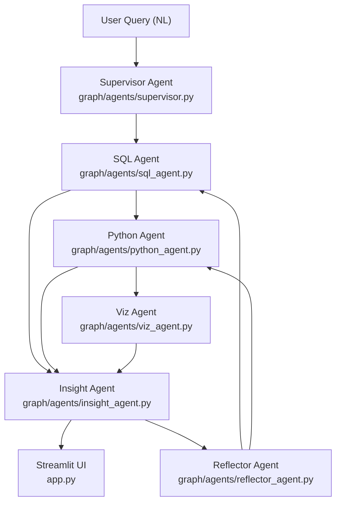

# ADBA — Kế Hoạch Triển Khai Chi Tiết (38 Ngày)

## Kiến trúc tổng quan

---

## MILESTONE 0 — Setup Môi Trường (Ngày 0, trước khi bắt đầu)

**Mục tiêu:** Môi trường sẵn sàng để code ngay

- Cài Python 3.11, tạo virtualenv `adba-env`
- `ollama pull qwen2.5-coder:7b-instruct-q5_K_M` + tạo `Modelfile` với `num_ctx 4096`
- Cài Docker Desktop, kiểm tra `docker compose version`
- Tạo cấu trúc thư mục `adba/` theo spec trong `.cursorrules`
- Tạo `requirements.txt` và `pip install -r requirements.txt`
- Tạo `.env.example` với `OPENAI_API_KEY`, `POSTGRES_URL`, `OLLAMA_BASE_URL`

**Output:** `ollama run adba-qwen "test"` trả về response

---

## MILESTONE 1 — Foundation + Single-Agent Pipeline (Ngày 1–22)

### Phase 1A: Infrastructure & Data (Ngày 1–6)

**Ngày 1–2 — Docker + Database + Schemas**

- File tạo: `docker-compose.yml` (postgres:15 + pgadmin)
- File tạo: `data/schemas/schema_sales.sql` — bảng `orders`, `products`, `customers`
- File tạo: `data/schemas/schema_inventory.sql` — bảng `stock`, `warehouses`, `stock_movements`
- File tạo: `data/schemas/schema_hr.sql` — bảng `employees`, `departments`, `payroll`
- File tạo: `data/seed/seed_data.py` — seed ~5,000 rows realistic data mỗi domain
- File tạo: `perception/extract_info_box.py` — kết nối psycopg2, query `information_schema`, xuất JSON `info_box`
- Checkpoint: `docker compose up -d` → postgres healthy, seed thành công

**Ngày 3–4 — Pydantic Schemas + Prompt Templates**

- File tạo: `schemas/plan_schema.py` — `ExecutionPlan`, `AgentStep` Pydantic models với validation
- File tạo: `schemas/insight_schema.py` — `InsightOutput`, `AnomalyInfo` Pydantic models
- File tạo: `prompts/text_to_sql.txt`
- File tạo: `prompts/data_analysis.txt`
- File tạo: `prompts/supervisor_routing.txt`
- File tạo: `prompts/insight_generation.txt`
- Checkpoint: `python -c "from schemas.plan_schema import ExecutionPlan; ..."` không lỗi

**Ngày 4–5 — Dataset Generation**

- File tạo: `training/generate_data.py` — GPT-4o-mini batch API call, sinh 1,500 samples (600 sql + 400 python + 200 supervisor + 150 insight + 100 reflector)
- File tạo: `training/validate_dataset.py` — chạy từng SQL sample trên postgres, filter lỗi
- Target: ≥1,200 valid samples, SQL exec rate ≥90%

**Ngày 6 — Format & Split**

- File tạo: `training/format_sharegpt.py` — convert sang ShareGPT format `{"messages": [...]}`
- Output: `data/train.json` (960), `data/val.json` (120), `data/test.json` (120)
- Checkpoint: `wc -l data/train.json` = 960 lines

---

### CHECKPOINT 1 — Ngày 7: Baseline Evaluation

**Ngày 7 — Baseline Eval (trước fine-tune)**

- File tạo: `eval/eval_runner.py` — chạy 120 test samples qua Ollama `qwen2.5-coder:7b` gốc
- Đo: SQL Execution Accuracy, JSON Valid Rate
- Lưu kết quả vào `eval/baseline_results.json`
- **Gate:** Ghi nhận baseline số liệu để so sánh sau fine-tune

---

### Phase 1B: Fine-Tuning (Ngày 8–14)

**Ngày 8 — Training Setup**

- File tạo: `training/mlx_config.yaml` — theo spec trong `.cursorrules` (lora_layers=16, batch_size=2, iters=1200)
- File tạo: `training/train_mlx.py` — wrapper script
- File tạo: `training/train_colab.ipynb` — Unsloth fallback cho Colab
- Dry run: `python -m mlx_lm.lora --config training/mlx_config.yaml` — check 10 steps không crash

**Ngày 9–11 — Fine-Tuning 3 Epochs**

- Chạy: `python -m mlx_lm.lora --config training/mlx_config.yaml`
- Monitor: val loss giảm đều qua các checkpoint (step 200, 400, ..., 1200)
- Save adapters vào `adapters/`

**Ngày 12 — Post-Training Evaluation**

- Chạy `eval/eval_runner.py` trên model đã fine-tune (fuse adapter)
- Lưu `eval/finetuned_results.json`
- **Gate:** SQL acc ≥70%, JSON valid ≥85%
- Nếu fail → Option B: dùng GPT-4o API cho Supervisor + SQL Agent

**Ngày 13–14 — Export Model + Model Client**

- Export GGUF q5_K_M: `python -m mlx_lm.fuse --model ... --save-path model/`
- File tạo: `model/model_config.py` — constants `PRIMARY_MODEL`, `AGENT_TEMPERATURES`, `AGENT_MAX_TOKENS`
- File tạo: `model/model_client.py` — `ModelClient` class wrapping Ollama SDK với retry, timeout, `safe_parse_json`

---

### CHECKPOINT 2 — Ngày 14: Model Ready

**Gate:** `ModelClient(agent_type="sql").invoke("Write SQL to count orders")` trả về SQL hợp lệ

---

### Phase 1C: Agent Pipeline (Ngày 15–20)

**Ngày 15 — State + Graph Skeleton**

- File tạo: `graph/state.py` — `MultiAgentState` TypedDict theo spec đầy đủ
- File tạo: `graph/utils.py` — `df_to_state()`, `df_from_state()`, `safe_parse_json()`, `append_trace()`
- File tạo: `graph/multi_agent.py` — skeleton LangGraph `StateGraph`, add nodes placeholder
- Checkpoint: state transitions test với mock data

**Ngày 16 — Supervisor Agent + Routing**

- File tạo: `graph/agents/supervisor.py` — `supervisor_node()`, `route_next_agent()` conditional edge
- Logic: parse query → gọi `ModelClient(agent_type="supervisor")` → parse `ExecutionPlan` JSON → Pydantic validate
- Unit test: 10 routing cases (simple query → [sql, insight], complex → [sql, python, viz, insight])

**Ngày 17–18 — SQL Agent + Python Agent + Tools**

- File tạo: `graph/tools/sql_tool.py` — `execute_sql()` (psycopg2 + pandas), `get_table_sample()`, `explain_query_plan()`
- File tạo: `graph/agents/sql_agent.py` — `sql_agent_node()`, retry loop max 3 lần, parameterized queries
- File tạo: `graph/tools/python_tool.py` — `run_pandas_safe()` với `PYTHON_SAFE_NAMESPACE` restricted exec
- File tạo: `graph/agents/python_agent.py` — `python_agent_node()`, nhận `shared_dataframe` từ state
- Unit tests: `tests/unit/test_sql_agent.py`, `tests/unit/test_python_agent.py`

**Ngày 19 — Viz Agent + Insight Agent + Reflector**

- File tạo: `graph/tools/viz_tool.py` — `generate_chart()` → matplotlib → base64 PNG
- File tạo: `graph/tools/insight_tools.py` — `detect_anomaly()` IQR method, `compare_periods()`
- File tạo: `graph/agents/viz_agent.py` — `viz_agent_node()`, auto chart type selection
- File tạo: `graph/agents/insight_agent.py` — `insight_agent_node()`, structured JSON output
- File tạo: `graph/agents/reflector_agent.py` — `reflector_agent_node()`, error classification
- Unit tests: `tests/unit/test_viz_agent.py`, `tests/unit/test_insight_agent.py`, `tests/unit/test_reflector.py`

**Ngày 20 — Wire Full Graph + Integration Tests**

- Hoàn thiện `graph/multi_agent.py` — add all nodes, conditional edges, compile graph
- File tạo: `tests/integration/test_simple_queries.py` — 10 queries SQL-only
- File tạo: `tests/integration/test_complex_queries.py` — 10 queries multi-agent
- **Gate:** ≥80% integration tests pass (≥16/20)

---

### CHECKPOINT 3 — Ngày 21–22: Demo Working

**Ngày 21–22 — Streamlit UI**

- File tạo: `app.py` — Streamlit app với:
  - Chat input + message history
  - DataFrame display (`st.dataframe`)
  - Chart display (`st.image` base64)
  - Insight card (`st.json` hoặc custom styled card)
  - Agent trace expander (`st.expander` cho từng agent)
- Chạy 5 demo queries end-to-end
- **Gate:** 5/5 queries hoàn thành không crash trong UI

---

## MILESTONE 2 — Full Multi-Agent + Production (Ngày 23–38)

### Phase 2A: Multi-Agent Refactor (Ngày 23–27)

**Ngày 23–24 — Refactor Specialist Agents**

- Tách biệt rõ ràng từng agent file (đã có từ M1, refactor để support dependency graph đầy đủ)
- Cập nhật `MultiAgentState` nếu cần thêm fields cho M2
- Đảm bảo tất cả agents đọc/ghi state theo đúng JSON-serializable format

**Ngày 25–26 — Supervisor v2 + Dependency Resolver**

- Nâng cấp `route_next_agent()` — full dependency graph resolution, parallel-ready (sequential thực thi)
- Sinh thêm 200 supervisor routing training samples (để dùng cho fine-tune lần 2 nếu cần)
- Lưu samples vào `data/` với format supervisor routing đặc biệt

**Ngày 27 — Insight Agent v2 + Anomaly Tools**

- Nâng cấp `insight_agent.py` — nhận đủ context (sql, python stats, chart metadata)
- Nâng cấp `insight_tools.py` — `detect_anomaly()` nâng cao (sigma-based), `compare_periods()` với YoY/QoQ

---

### Phase 2B: Error Handling + Evaluation (Ngày 28–32)

**Ngày 28 — Reflector v2**

- Nâng cấp `reflector_agent.py` — domain-aware (phân biệt sql_syntax vs sql_logic vs data_quality)
- Smart rerouting: reflector ghi `corrected_context` vào state, agent retry với context mới

**Ngày 29–30 — Multi-Agent Integration Tests**

- Cập nhật `tests/integration/` — 10 simple + 10 complex multi-agent queries
- Test error recovery: inject lỗi SQL, kiểm tra reflector → retry flow
- **Gate:** ≥16/20 pass, Supervisor routing accuracy ≥80%

**Ngày 31–32 — Docker Sandbox + Ragas Evaluation**

- File tạo: `sandbox/Dockerfile` — Python image với pandas/numpy/matplotlib, không internet
- File tạo: `sandbox/sandbox_client.py` — Docker SDK, run code trong container, timeout 30s
- Cập nhật `python_agent.py` để dùng sandbox thay direct `exec()`
- Cập nhật `eval/eval_runner.py` — thêm Ragas metrics + Agent Routing Accuracy
- Chạy evaluation toàn bộ test set, lưu `eval/finetuned_results.json`

---

### Phase 2C: Analysis + Production Deploy (Ngày 33–38)

**Ngày 33–35 — Single vs Multi-Agent Comparison**

- Chạy cùng test set (120 queries) trên:
  - Single-agent baseline (chỉ SQL Agent, không Supervisor)
  - Full multi-agent pipeline
- Đo tất cả 7 metrics theo spec
- Lưu `eval/single_vs_multi_comparison.json`
- Viết analysis section cho báo cáo

**Ngày 36–37 — Production Docker-Compose + README**

- Cập nhật `docker-compose.yml` — thêm service `adba-app` (Streamlit), `adba-sandbox`
- Tạo `README.md` — installation, quick start, architecture diagram, demo screenshots
- `.env.example` hoàn chỉnh

**Ngày 38 — Video Demo + Final Cleanup**

- Quay video demo 5 phút: 3 queries (simple / complex / error recovery)
- Final linting, remove debug prints
- Tag release `v1.0.0`

---

## Checkpoints & Fallback Summary

- **Ngày 7 (CP1):** Dataset quality gate — fail → +1 ngày manual filter
- **Ngày 14 (CP2):** Model quality gate — fail → GPT-4o API fallback cho Supervisor + SQL
- **Ngày 22 (CP3):** Single-agent demo gate — fail → scope cut bỏ Viz Agent
- **Ngày 30 (CP4):** Multi-agent gate — fail → submit single-agent + architecture report

## Evaluation Targets

- SQL Execution Accuracy: ≥82%
- JSON Plan Valid Rate: ≥88%
- Agent Routing Accuracy: ≥85%
- End-to-End Success Rate: ≥75%
- Insight Quality Score: ≥3.8/5
- Average Retry Count: ≤1.2/query
- Latency P50: ≤25s

