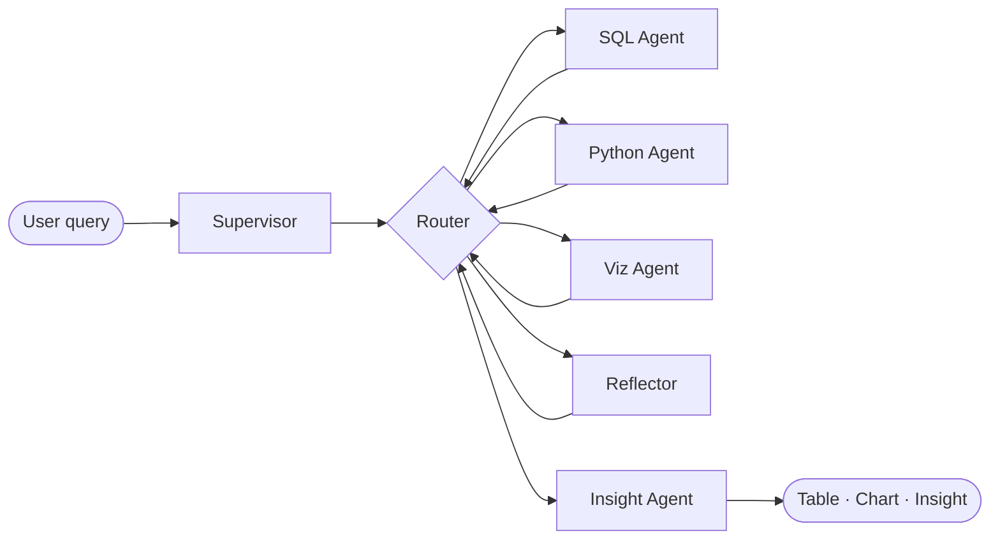

# ADBA

### Autonomous Data & Business Intelligence Agent

**Hệ thống đa-agent** nhận câu hỏi tiếng Việt / tiếng Anh → lập kế hoạch → SQL · Python · Viz → **business insight** có thể hành động.

[Python](https://www.python.org/)
[LangGraph](https://github.com/langchain-ai/langgraph)
[PostgreSQL](https://www.postgresql.org/)
[Ollama](https://ollama.com/)

[Hugging Face · merged model](#-fine-tuned-model-hugging-face) · [Đặc tả chi tiết](docs/ADBA_Project_Specification_vi.md) · [AGENTS.md](AGENTS.md)


**Mục lục**

- [Giới thiệu](#giới-thiệu-dự-án)
- [Tính năng](#tính-năng-chính)
- [Kiến trúc](#kiến-trúc)
- [Stack](#built-with)
- [Cài đặt](#getting-started)
- [Chạy & đánh giá](#usage)
- [Fine-tuned model](#-fine-tuned-model-hugging-face)
- [Roadmap](#roadmap)
- [Đóng góp](#contributing)
- [Giấy phép](#license)
- [Liên hệ](#contact)
- [Lời cảm ơn](#acknowledgments)


---

## Giới thiệu dự án

**ADBA** (Autonomous Data & Business Intelligence Agent) là pipeline **LangGraph** gồm một **Supervisor** và các specialist (**SQL**, **Python**, **Viz**, **Insight**, **Reflector**): trích xuất dữ liệu từ PostgreSQL, phân tích với pandas, vẽ biểu đồ, và sinh **insight có cấu trúc** (finding · evidence · action).

Ý tưởng nền tảng xuất phát từ bài báo *Autonomous Data Agents* (Fu et al., 2025, [arXiv:2509.18710](https://arxiv.org/abs/2509.18710)); phần **multi-agent collaboration** được triển khai đầy đủ trong code.

([back to top](#readme-top))

---

## Tính năng chính


| Khối                | Mô tả                                                                            |
| ------------------- | -------------------------------------------------------------------------------- |
| **Supervisor**      | Sinh **ExecutionPlan** JSON (agent, task, `depends_on`)                          |
| **SQL Agent**       | Text-to-SQL + thực thi PostgreSQL an toàn                                        |
| **Python Agent**    | Transform / anomaly với pandas trong sandbox giới hạn                            |
| **Viz Agent**       | matplotlib → chart (pipeline UI)                                                 |
| **Insight Agent**   | Output JSON validate **Pydantic** (`InsightOutput`)                              |
| **Reflector Agent** | Phân loại lỗi & ngữ cảnh sửa khi retry                                           |
| **Perception**      | `info_box` từ introspection schema (`perception/`)                               |
| **Training / Eval** | SFT data pipeline, MLX/Unsloth notebooks, **eval_runner** / **eval_peft_runner** |


([back to top](#readme-top))

---

## Kiến trúc




Luồng thực tế được định nghĩa trong `[graph/multi_agent.py](graph/multi_agent.py)` và các node trong `[graph/agents/](graph/agents/)`.

([back to top](#readme-top))

---

## Built With

- [LangChain](https://www.langchain.com/) · **LangGraph**
- **Ollama** (+ tuỳ chọn OpenAI fallback cho một số agent)
- **PostgreSQL 15**
- **Streamlit** (`[app.py](app.py)`)
- **Pydantic v2**, **pandas**, **matplotlib**
- **Training**: MLX-LM / notebooks QLoRA (Kaggle, Windows GPU)
- **Eval**: Hugging Face **PEFT** + Postgres (`[eval/](eval/)`)

([back to top](#readme-top))

---

## Getting Started

### Yêu cầu

- **Python 3.11+**
- **Docker** (PostgreSQL)
- **Ollama** — khuyến nghị `OLLAMA_NUM_CTX=4096`
- Biến môi trường — copy và chỉnh:

Tạo file `**.env`** theo `[AGENTS.md](AGENTS.md)` (không commit `.env`).


| Biến                                | Ý nghĩa                                         |
| ----------------------------------- | ----------------------------------------------- |
| `POSTGRES_URL`                      | Chuỗi kết nối PostgreSQL                        |
| `PRIMARY_MODEL` / `OLLAMA_BASE_URL` | Model & endpoint Ollama                         |
| `HF_TOKEN`                          | Khi dùng model private trên Hugging Face        |
| `OPENAI_API_KEY`                    | Fallback (tuỳ cấu hình `model/model_client.py`) |


### Cài đặt

```bash
git clone https://github.com/DangVanVy23521825/ADBA.git
cd adba

python -m venv .venv
source .venv/bin/activate          # Windows: .venv\Scripts\activate

pip install -r requirements.txt

docker compose up -d
./scripts/apply_schemas_docker.sh   # hoặc script DDL trong repo / docs
python data/seed/seed_data.py

python perception/extract_info_box.py
```

**Gợi ý Ollama (Mac / Linux)**

```bash
export OLLAMA_NUM_CTX=4096
ollama pull qwen2.5-coder:7b-instruct-q5_K_M
```


([back to top](#readme-top))

---

## Usage

### Streamlit UI

```bash
export PYTHONPATH=.
streamlit run app.py
```

### Kiểm thử & đánh giá

```bash
PYTHONPATH=. pytest tests/ -v

# Baseline (Ollama + Postgres)
PYTHONPATH=. python eval/eval_runner.py --limit 10

# Fine-tuned adapter PEFT (GPU khuyến nghị)
PYTHONPATH=. python eval/eval_peft_runner.py --adapter training/checkpoint-50 --limit 10

# So sánh baseline vs finetuned (sau khi có hai file JSON kết quả)
PYTHONPATH=. python eval/eval_compare.py
```

Chi tiết PEFT / CUDA / Mac CPU: `[eval/README_finetuned_eval.md](eval/README_finetuned_eval.md)`.

### Notebook merge LoRA → `merged_hf` (Kaggle GPU)

`[training/kaggle_merge_lora_export.ipynb](training/kaggle_merge_lora_export.ipynb)`

([back to top](#readme-top))

---

## 🤗 Fine-tuned model (Hugging Face)

Phiên bản **merged** (base **Qwen2.5-Coder-7B-Instruct** + LoRA huấn luyện cho ADBA) được publish để tái sử dụng inference / vLLM:

`**[dangvanvy/adba-qwen-merged](https://huggingface.co/dangvanvy/adba-qwen-merged)`**

- Repo có thể **private** → cần `HF_TOKEN` khi `from_pretrained`.
- Tuân thủ **license và điều khoản** của model gốc Qwen — không được suy diễn rộng hơn điều khoản nhà phát hành cho phép.

([back to top](#readme-top))

---

## Contributing

Mọi đóng góp đều được hoan nghênh.

1. Fork repo
2. Tạo branch (`git checkout -b feature/featureTenHay`)
3. Commit (`git commit -m 'feat: mô tả ngắn'`)
4. Push (`git push origin feature/featureTenHay`)
5. Mở Pull Request

Không commit **secrets** (`.env`), và không đưa **weights lớn** (checkpoint LoRA đầy đủ, DB dump khổng lồ) vào Git — dùng `.gitignore`, Hugging Face Hub hoặc artifact riêng.

([back to top](#readme-top))

---

## License

- **Source code** của repo này: đặt trong file `**LICENSE`** khi bạn chọn giấy phép cụ thể (MIT / Apache-2.0 / …).
- **Weights fine-tuned / merged** phải tuân thủ license của **[Qwen/Qwen2.5-Coder-7B-Instruct](https://huggingface.co/Qwen/Qwen2.5-Coder-7B-Instruct)** và các điều khoản Alibaba/Qwen applicable — không được lan truyền trái license.

([back to top](#readme-top))

---

## Contact

**Đặng Văn Vỹ** — `[dangvanvy](https://huggingface.co/dangvanvy)` · Email: *dangvanvy112@gmail.com* 

Project Link: `[https://github.com/DangVanVy23521825/ADBA](https://github.com/DangVanVy23521825/ADBA)`

([back to top](#readme-top))

---

## Acknowledgments

- [Fu et al. — Autonomous Data Agents, arXiv:2509.18710](https://arxiv.org/abs/2509.18710)
- [Qwen Team — Qwen2.5-Coder](https://huggingface.co/Qwen)
- [LangGraph](https://github.com/langchain-ai/langgraph)

([back to top](#readme-top))