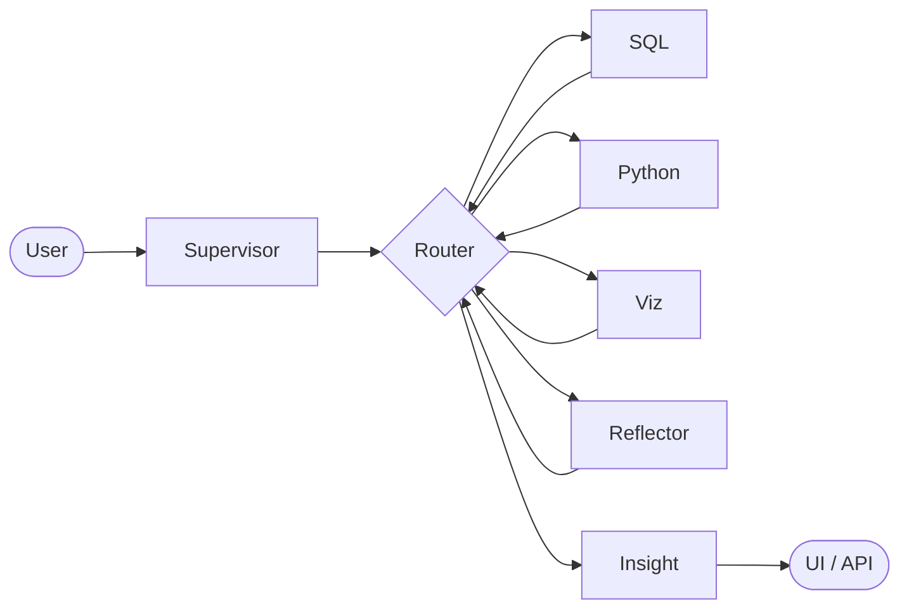

<!-- Improved compatibility of back to top link: See: https://github.com/othneildrew/Best-README-Template/pull/73 -->
<a id="readme-top"></a>

<!--
ADBA — Autonomous Data & Business Intelligence Agent
-->

[![Contributors][contributors-shield]][contributors-url]
[![Forks][forks-shield]][forks-url]
[![Stargazers][stars-shield]][stars-url]
[![Issues][issues-shield]][issues-url]
[![License][license-shield]][license-url]
[![Hugging Face Models][hf-shield]][hf-url]

<br />
<div align="center">
  <a href="https://github.com/DangVanVy23521825/ADBA">
    
  </a>

  <h3 align="center">ADBA · Autonomous Data & Business Intelligence Agent</h3>

  <p align="center">
    A <strong>multi-agent</strong> system (Supervisor + SQL · Python · Viz · Insight · Reflector) built on <strong>LangGraph</strong>, <strong>PostgreSQL</strong>, and <strong>Ollama</strong>.
    <br />
    <a href="docs/ADBA_Project_Specification_vi.md"><strong>Project Specification (VI) »</strong></a>
    <br />
    <br />
    <a href="https://huggingface.co/dangvanvy/adba-qwen-merged">Merged Model (HF)</a>
    ·
    <a href="https://github.com/DangVanVy23521825/ADBA/issues/new?labels=bug">Report Bug</a>
    ·
    <a href="https://github.com/DangVanVy23521825/ADBA/issues/new?labels=enhancement">Request Feature</a>
  </p>
</div>

<details>
  <summary><b>Table of Contents</b></summary>
  <ol>
    <li>
      <a href="#about-the-project">About The Project</a>
      <ul>
        <li><a href="#built-with">Built With</a></li>
      </ul>
    </li>
    <li>
      <a href="#getting-started">Getting Started</a>
      <ul>
        <li><a href="#prerequisites">Prerequisites</a></li>
        <li><a href="#installation">Installation</a></li>
      </ul>
    </li>
    <li><a href="#usage">Usage</a></li>
    <li><a href="#fine-tuned-model-hugging-face">Fine-tuned model</a></li>
    <li><a href="#roadmap">Roadmap</a></li>
    <li><a href="#contributing">Contributing</a></li>
    <li><a href="#license">License</a></li>
    <li><a href="#contact">Contact</a></li>
    <li><a href="#acknowledgments">Acknowledgments</a></li>
  </ol>
</details>

## About The Project

ADBA is a **multi-agent analytics system** that transforms **Vietnamese and English** questions into executable workflows. A Supervisor agent generates an **ExecutionPlan**, routes tasks to specialist agents for **PostgreSQL querying**, **pandas analysis**, and **visualization**, while an **Insight Agent** produces structured outputs (**finding · evidence · action**) validated with **Pydantic**. A **Reflector** agent monitors failures and performs retries when necessary.

The project is inspired by *Autonomous Data Agents* (Fu et al., 2025, [arXiv:2509.18710](https://arxiv.org/abs/2509.18710)), with the paper's **multi-agent collaboration paradigm** implemented in practice.



Graph Flows: [`graph/multi_agent.py`](graph/multi_agent.py) · agents: [`graph/agents/`](graph/agents/).

<p align="right">(<a href="#readme-top">back to top</a>)</p>

### Built With

* [![Python][Python-badge]][Python-url]
* [![LangGraph][LangGraph-badge]][LangGraph-url]
* [![PostgreSQL][Postgres-badge]][Postgres-url]
* [![Streamlit][Streamlit-badge]][Streamlit-url]
* [![Ollama][Ollama-badge]][Ollama-url]
* [![Hugging Face][Hf-badge-small]][hf-url]
* [![Pydantic][Pydantic-badge]][Pydantic-url]

<p align="right">(<a href="#readme-top">back to top</a>)</p>

## Getting Started

Clone the repository, create a venv, enable Postgres (Docker), seed data, and run Ollama with the full context.

### Prerequisites

* **Python 3.11+**
* **Docker** (for PostgreSQL)
* **Ollama** — should be `OLLAMA_NUM_CTX=4096`

### Installation

1. Clone repository

   ```bash
   git clone https://github.com/DangVanVy23521825/ADBA.git
   cd ADBA
   ```

2. Virtualenv & dependencies

   ```bash
   python -m venv .venv
   source .venv/bin/activate    # Windows: .venv\Scripts\activate
   pip install -r requirements.txt
   ```

3. Create `.env` (no commit): see the variables in [`model/model_config.py`](model/model_config.py), [`eval/eval_runner.py`](eval/eval_runner.py), and Docker Compose — with at least `POSTGRES_URL`, `PRIMARY_MODEL`, `OLLAMA_BASE_URL`.

4. Database

   ```bash
   docker compose up -d
   ./scripts/apply_schemas_docker.sh
   python data/seed/seed_data.py
   python perception/extract_info_box.py
   ```

5. **Ollama (recommended)**

   ```bash
   export OLLAMA_NUM_CTX=4096
   ollama pull qwen2.5-coder:7b-instruct-q5_K_M
   ```

<p align="right">(<a href="#readme-top">back to top</a>)</p>

## Usage

**Streamlit**

```bash
export PYTHONPATH=.
streamlit run app.py
```

**Tests**

```bash
PYTHONPATH=. pytest tests/ -v
```

**Eval**

```bash
PYTHONPATH=. python eval/eval_runner.py --limit 10
PYTHONPATH=. python eval/eval_peft_runner.py --adapter training/checkpoint-50 --limit 10
PYTHONPATH=. python eval/eval_compare.py
```

PEFT Details: [`eval/README_finetuned_eval.md`](eval/README_finetuned_eval.md) · Notebook merge on Kaggle: [`training/kaggle_merge_lora_export.ipynb`](training/kaggle_merge_lora_export.ipynb).

*Vietnamese_SPEC:* [`docs/ADBA_Project_Specification_vi.md`](docs/ADBA_Project_Specification_vi.md)

<p align="right">(<a href="#readme-top">back to top</a>)</p>

## Fine-tuned model (Hugging Face)

**[dangvanvy/adba-qwen-merged](https://huggingface.co/dangvanvy/adba-qwen-merged)** — Qwen2.5-Coder-7B-Instruct merged with LoRA (ADBA). Repo private → need `HF_TOKEN`. Comply with the original license model [Qwen2.5-Coder-7B-Instruct](https://huggingface.co/Qwen/Qwen2.5-Coder-7B-Instruct).

<p align="right">(<a href="#readme-top">back to top</a>)</p>

## Roadmap

- [x] LangGraph multi-agent workflow (Supervisor + Specialists + Reflector)
- [x] Structured Insight JSON (Pydantic) + Evaluation / PEFT pipelines
- [x] Merged model weights published on Hugging Face Hub
- [ ] Secure Docker sandbox for Python execution
- [ ] CI evaluation smoke tests and routing metrics
- [ ] Production inference deployment (vLLM / GPU cloud) with HTTPS

See [Issues](https://github.com/DangVanVy23521825/ADBA/issues).

<p align="right">(<a href="#readme-top">back to top</a>)</p>

## Contributing

Contributions, issues, and feature requests are welcome.

1. Fork the Project
2. Create your Feature Branch (`git checkout -b feature/AmazingFeature`)
3. Commit your changes (`git commit -m 'feat: add AmazingFeature'`)
4. Push to the Branch (`git push origin feature/AmazingFeature`)
5. Open a Pull Request

**Note:** Please do not commit `.env` files, large model weights, or database dumps. Use `.gitignore` and dedicated artifact repositories (e.g., Hugging Face Hub) when appropriate.

### Top Contributors

<a href="https://github.com/DangVanVy23521825/ADBA/graphs/contributors">
  
</a>

<p align="right">(<a href="#readme-top">back to top</a>)</p>

## License

If you choose a specific license for this repository, please add a **`LICENSE`** file. Fine-tuned and merged model weights must comply with the applicable licensing terms of **Qwen / Alibaba**.

<p align="right">(<a href="#readme-top">back to top</a>)</p>

## Contact

**Đặng Văn Vỹ** · [Hugging Face](https://huggingface.co/dangvanvy) · [dangvanvy112@gmail.com](mailto:dangvanvy112@gmail.com)

Project Link: [https://github.com/DangVanVy23521825/ADBA](https://github.com/DangVanVy23521825/ADBA)

<p align="right">(<a href="#readme-top">back to top</a>)</p>

## Acknowledgments

* [Fu et al. — Autonomous Data Agents, arXiv:2509.18710](https://arxiv.org/abs/2509.18710)
* [Qwen Team](https://huggingface.co/Qwen)
* [LangGraph](https://github.com/langchain-ai/langgraph)
* [othneildrew / Best-README-Template](https://github.com/othneildrew/Best-README-Template)
* [Img Shields](https://shields.io)

<p align="right">(<a href="#readme-top">back to top</a>)</p>

---

<!-- MARKDOWN LINKS & IMAGES -->

[contributors-shield]: https://img.shields.io/github/contributors/DangVanVy23521825/ADBA.svg?style=for-the-badge
[contributors-url]: https://github.com/DangVanVy23521825/ADBA/graphs/contributors
[forks-shield]: https://img.shields.io/github/forks/DangVanVy23521825/ADBA.svg?style=for-the-badge
[forks-url]: https://github.com/DangVanVy23521825/ADBA/network/members
[stars-shield]: https://img.shields.io/github/stars/DangVanVy23521825/ADBA.svg?style=for-the-badge
[stars-url]: https://github.com/DangVanVy23521825/ADBA/stargazers
[issues-shield]: https://img.shields.io/github/issues/DangVanVy23521825/ADBA.svg?style=for-the-badge
[issues-url]: https://github.com/DangVanVy23521825/ADBA/issues
[license-shield]: https://img.shields.io/github/license/DangVanVy23521825/ADBA.svg?style=for-the-badge
[license-url]: https://github.com/DangVanVy23521825/ADBA/blob/main/LICENSE
[hf-shield]: https://img.shields.io/badge/Hugging_Face-adba--qwen--merged-FFD21F?style=for-the-badge&logo=huggingface&logoColor=000
[hf-url]: https://huggingface.co/dangvanvy/adba-qwen-merged

[Python-badge]: https://img.shields.io/badge/Python-3776AB?style=for-the-badge&logo=python&logoColor=white
[Python-url]: https://www.python.org/
[LangGraph-badge]: https://img.shields.io/badge/LangGraph-1C3C3C?style=for-the-badge&logo=langchain&logoColor=white
[LangGraph-url]: https://github.com/langchain-ai/langgraph
[Postgres-badge]: https://img.shields.io/badge/PostgreSQL-4169E1?style=for-the-badge&logo=postgresql&logoColor=white
[Postgres-url]: https://www.postgresql.org/
[Streamlit-badge]: https://img.shields.io/badge/Streamlit-FF4B4B?style=for-the-badge&logo=streamlit&logoColor=white
[Streamlit-url]: https://streamlit.io/
[Ollama-badge]: https://img.shields.io/badge/Ollama-000000?style=for-the-badge&logo=ollama&logoColor=white
[Ollama-url]: https://ollama.com/
[Hf-badge-small]: https://img.shields.io/badge/PEFT%2FHF-FFD21F?style=for-the-badge&logo=huggingface&logoColor=000
[Pydantic-badge]: https://img.shields.io/badge/Pydantic-v2-E92063?style=for-the-badge
[Pydantic-url]: https://docs.pydantic.dev/
