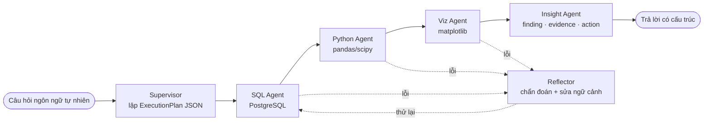

# PRD / Project Charter — ADBA

> **Product Requirement Document** · Autonomous Data & Business Intelligence Agent
> Trạng thái: đang phát triển · Chủ dự án: Đặng Văn Vỹ

---

## 1. Bài toán

Trong một doanh nghiệp vừa, câu hỏi dạng *"quý vừa rồi miền nào tụt doanh thu, và vì sao?"*
đi qua một đường vòng cố định:

1. Người ra quyết định (trưởng phòng kinh doanh, giám đốc) không viết được SQL.
2. Họ gửi yêu cầu cho data analyst.
3. Analyst mất 30 phút–2 ngày: viết SQL, kéo ra Excel, vẽ chart, viết vài dòng nhận xét.
4. Kết quả trả về thường sinh ra câu hỏi tiếp theo → lặp lại từ bước 2.

Ba hệ quả:

- **Độ trễ ra quyết định** — thứ đáng lẽ mất 20 giây thì mất một ngày làm việc.
- **Analyst làm việc lặp**: 60–80% yêu cầu là truy vấn mô tả (`GROUP BY` + so sánh kỳ),
  không phải phân tích sâu.
- **Câu trả lời dừng ở con số.** Bảng doanh thu theo vùng không nói *"nên làm gì"*.
  Bước từ dữ liệu sang hành động vẫn nằm trong đầu một người.

**Vì sao text-to-SQL đơn thuần không giải quyết được.** Một model sinh SQL một lần chỉ xử lý
được bước 3a. Nó không tự sửa khi query lỗi, không phân tích tiếp trên kết quả, không vẽ chart,
và không viết ra khuyến nghị. Nói cách khác nó thay bàn phím của analyst, chứ không thay quy trình.

## 2. Giải pháp

ADBA là **hệ đa-agent** trên LangGraph: một Supervisor lập kế hoạch, các agent chuyên trách
thực thi, một Reflector chẩn đoán khi có lỗi.

Bốn tính chất phân biệt ADBA với một wrapper text-to-SQL:

| Tính chất | Cụ thể trong ADBA |
|---|---|
| **Lập kế hoạch trước khi làm** | Supervisor sinh DAG các bước, validate bằng Pydantic (không chu trình, không phụ thuộc tiến, `insight` luôn cuối) |
| **Tự phục hồi** | Mỗi agent retry nội bộ; hết lượt thì Reflector chẩn đoán phân loại lỗi và trả về ngữ cảnh đã sửa |
| **Đầu ra có hợp đồng** | `InsightOutput` ép đúng một câu finding, danh sách evidence, một câu action bắt đầu bằng động từ hành động |
| **Chạy tại chỗ** | Ollama trên máy khách; dữ liệu doanh nghiệp không rời hạ tầng nội bộ |

Nền tảng học thuật: *Autonomous Data Agents* (Fu et al., 2025, [arXiv:2509.18710](https://arxiv.org/abs/2509.18710)).
ADBA hiện thực hoá phần **multi-agent collaboration** của khung này.

## 3. Mục tiêu

### Mục tiêu sản phẩm

| # | Mục tiêu | Đo bằng |
|---|---|---|
| G1 | Người không biết SQL tự lấy được câu trả lời | Tỷ lệ câu hỏi tự nhiên → insight không lỗi (end-to-end success ≥ 75%) |
| G2 | Trả lời đủ nhanh để hỏi tiếp trong cùng một buổi | Latency P50 ≤ 25 s; SLO ≤ 45 s cho 90% truy vấn |
| G3 | Câu trả lời hành động được, không chỉ là số | Insight quality (chấm bởi LLM judge) ≥ 3,8/5 |
| G4 | Dữ liệu không rời hạ tầng khách hàng | Chạy trọn với Ollama nội bộ, không bắt buộc gọi API ngoài |
| G5 | Sai thì tự sửa, không im lặng trả kết quả sai | Avg retry ≤ 1,2/truy vấn; 0 mutation SQL chạm tới DB |

### Mục tiêu kỹ thuật

| # | Mục tiêu | Trạng thái |
|---|---|---|
| T1 | Model 7B cục bộ đạt SQL execution accuracy ≥ 82% | ✅ Đạt — baseline 84,4%, LoRA 96,9% (xem [metric](../03-flows/AGENT_ARCHITECTURE.md#kết-quả-đánh-giá)) |
| T2 | Output JSON của LLM luôn được validate trước khi dùng | ✅ Đạt — Pydantic ở cả plan lẫn insight |
| T3 | Pipeline không treo vô hạn khi agent lỗi | ⚠️ Một phần — có trần retry, chưa có ngân sách thời gian toàn cục |
| T4 | Python agent chạy trong ranh giới cô lập thật | ⚠️ Một phần — sandbox theo process + whitelist import, chưa container hoá |
| T5 | Không hardcode tên bảng ở bất kỳ đâu | ❌ Chưa — `graph/tools/sql_tool.py` còn whitelist tĩnh |

## 4. Phạm vi

### Trong phạm vi (v1)

- Truy vấn **đọc** trên PostgreSQL, ba domain: sales, inventory, HR.
- Câu hỏi tiếng Việt và tiếng Anh, dạng mô tả và so sánh (theo vùng, kỳ, hạng mục, phân khúc).
- Phân tích tiếp trên kết quả: tăng trưởng, tỷ trọng, xếp hạng, phát hiện bất thường thống kê.
- Biểu đồ: bar/hbar, line, scatter, histogram, pie — chọn kiểu tự động theo dạng dữ liệu.
- Insight có cấu trúc kèm mức tin cậy và cờ bất thường.
- Giao diện chat Streamlit có hiển thị execution plan và agent trace.
- Fine-tune LoRA/QLoRA trên Qwen2.5-Coder-7B-Instruct cho 5 skill của hệ thống.
- Triển khai Docker Compose (app + PostgreSQL), CI chạy unit test và đẩy image lên GHCR.

### Ngoài phạm vi (v1) — và vì sao

| Không làm | Lý do |
|---|---|
| Ghi dữ liệu (INSERT/UPDATE/DELETE) | Agent tự sinh câu lệnh ghi là rủi ro không tương xứng với giá trị; đường production dự kiến dùng role read-only |
| Đăng nhập, phân quyền theo người dùng, multi-tenant | v1 chạy nội bộ một tổ chức; phân quyền theo hàng nằm ở spec [multi-schema](../superpowers/specs/2026-08-15-adba-multi-schema-onprem-design.md) |
| Nguồn dữ liệu ngoài PostgreSQL (MySQL, BigQuery, file Excel) | Mỗi phương ngữ SQL là một trục lỗi mới; làm đúng một cái trước |
| Dự báo / mô hình dự đoán (ARIMA, Prophet, ML) | Khác hẳn về mặt đánh giá chất lượng; ADBA mô tả và giải thích, không dự báo |
| Dashboard lưu sẵn, báo cáo định kỳ, gửi email | ADBA trả lời câu hỏi tại thời điểm hỏi, không thay Metabase/Superset |
| Hội thoại nhiều lượt có nhớ ngữ cảnh câu trước | Mỗi truy vấn hiện là một lần chạy graph độc lập |
| Giọng nói, mobile app | Không phải nút thắt của bài toán |

### Ràng buộc

- **Phần cứng**: chạy được trên máy tính cá nhân (MacBook M2 16 GB) — quyết định này ép model
  xuống mức 7B lượng tử hoá và context 4096 token.
- **Context 4096 token** là ràng buộc thiết kế sâu nhất: `info_box` phải nén đủ để vừa cùng
  câu hỏi, plan và lịch sử hành động. Đây là lý do có perception layer thay vì nhét cả DDL.
- **Không phụ thuộc API ngoài**: mặc định `ADBA_DEPLOYMENT=onprem` chặn mọi lời gọi model ngoài. OpenAI chỉ khả dụng khi đặt `hybrid` một cách tường minh — một quyết định thương mại, không phải mặc định.

## 5. User Personas

### P1 — Trang, Trưởng phòng Kinh doanh Vùng *(người dùng chính)*

- **Bối cảnh**: quản lý doanh số 4 vùng, họp review hàng tuần.
- **Trình độ kỹ thuật**: dùng thành thạo Excel, không viết SQL.
- **Việc cần làm**: "Doanh thu miền Trung quý này so quý trước thế nào, và nhóm hàng nào kéo xuống?"
- **Hiện đang làm gì**: nhắn Slack cho analyst, chờ đến chiều.
- **Thành công với ADBA nghĩa là**: có câu trả lời kèm biểu đồ trong lúc đang họp, hỏi tiếp được ngay.
- **Ảnh hưởng lên thiết kế**: câu trả lời phải có *action* — không được dừng ở bảng số.

### P2 — Huy, Data Analyst *(người dùng chính, cũng là người kiểm chứng)*

- **Bối cảnh**: một mình phục vụ 5 phòng ban.
- **Trình độ**: SQL, Python, pandas thành thạo.
- **Việc cần làm**: dẹp bớt các yêu cầu lặp để tập trung vào phân tích sâu.
- **Điều khiến anh ấy không tin công cụ**: SQL sai mà vẫn trả về số trông có vẻ đúng.
- **Thành công với ADBA nghĩa là**: xem được **SQL đã chạy** và **execution plan**, tự kiểm tra 30 giây.
- **Ảnh hưởng lên thiết kế**: agent trace và câu SQL luôn hiển thị trong UI, không giấu.

### P3 — Nam, Giám đốc Vận hành *(người dùng phụ)*

- **Bối cảnh**: theo dõi tồn kho và chi phí nhân sự.
- **Việc cần làm**: "Kho nào sắp dưới ngưỡng tồn tối thiểu?" — câu hỏi cần dữ liệu liên domain.
- **Thành công nghĩa là**: nêu được rủi ro trước khi nó thành sự cố.
- **Ảnh hưởng lên thiết kế**: `info_box_all.json` gộp cả ba domain để hỗ trợ join chéo.

### P4 — Linh, Kỹ sư triển khai *(người vận hành, không phải người dùng cuối)*

- **Việc cần làm**: cài ADBA trong mạng nội bộ khách hàng, không có internet.
- **Thành công nghĩa là**: `docker compose up` là xong, không có bước gọi ra ngoài.
- **Ảnh hưởng lên thiết kế**: mọi cấu hình qua biến môi trường; model đóng gói kèm.

## 6. Yêu cầu chức năng

| ID | Yêu cầu | Mức | Nơi hiện thực |
|---|---|---|---|
| FR-1 | Nhận câu hỏi tiếng Việt/Anh qua giao diện chat | Phải có | `app.py` |
| FR-2 | Sinh ExecutionPlan JSON và validate DAG trước khi chạy | Phải có | `graph/agents/supervisor.py`, `schemas/plan_schema.py` |
| FR-3 | Sinh và thực thi SQL trên PostgreSQL, tự sửa tối đa 3 lượt | Phải có | `graph/agents/sql_agent.py` |
| FR-4 | Chạy code pandas do model sinh trong sandbox hạn chế | Phải có | `graph/tools/python_tool.py` |
| FR-5 | Sinh biểu đồ PNG base64, tự chọn kiểu theo dữ liệu | Phải có | `graph/tools/viz_tool.py` |
| FR-6 | Sinh insight có cấu trúc, validate bằng Pydantic | Phải có | `graph/agents/insight_agent.py`, `schemas/insight_schema.py` |
| FR-7 | Chẩn đoán lỗi và định tuyến lại khi agent thất bại | Phải có | `graph/agents/reflector_agent.py` |
| FR-8 | Hiển thị execution plan, agent trace, SQL đã chạy | Phải có | `app.py` |
| FR-9 | Trích xuất ngữ cảnh schema tự động từ PostgreSQL | Phải có | `perception/extract_info_box.py` |
| FR-10 | Phát hiện bất thường thống kê và gắn cờ trong insight | Nên có | `graph/tools/insight_tools.py` |
| FR-11 | Trả kết quả một phần khi hết ngân sách thời gian | Nên có | Chưa làm — xem [spec hardening](../superpowers/specs/2026-08-12-adba-mcp-hardening-design.md) |

## 7. Yêu cầu phi chức năng

| ID | Yêu cầu | Ngưỡng | Trạng thái |
|---|---|---|---|
| NFR-1 | Latency P50 | ≤ 25 s | Cần đo lại end-to-end |
| NFR-2 | Worst-case wall clock | ≤ 60 s | ❌ Hiện có thể chạy rất lâu — thiếu deadline toàn cục |
| NFR-3 | Không có câu lệnh ghi chạm tới DB | 0, kiểm bằng test đối kháng | ⚠️ Chưa có SQL guard nhiều lớp |
| NFR-4 | Timeout truy vấn ở tầng DB | `SET LOCAL statement_timeout` 30 s | ✅ `graph/tools/sql_tool.py` |
| NFR-5 | Timeout sandbox Python | 10 s, cưỡng chế bằng process | ✅ `PANDAS_EXEC_TIMEOUT_SECONDS` |
| NFR-6 | Chạy được offline hoàn toàn | Không gọi mạng ngoài khi tắt fallback | ✅ |
| NFR-7 | Unit test xanh trên CI mọi PR | 100% | ✅ `.github/workflows/ci-cd.yml` |

## 8. Tiêu chí thành công của dự án

Dự án coi là thành công khi đồng thời:

1. Một người không biết SQL hỏi 10 câu thực tế và nhận được ≥ 8 câu trả lời đúng, hành động được.
2. Analyst đọc SQL do agent sinh và xác nhận đúng ý định, không cần sửa.
3. Toàn hệ chạy trên một máy không có internet.
4. Bộ metric eval được ghi lại và tái lập được bằng `eval/eval_runner.py`.
5. Có bản demo và tag phiên bản `v1.0.0`.

## 9. Rủi ro đã biết

| Rủi ro | Ảnh hưởng | Cách giảm thiểu |
|---|---|---|
| Model 7B viết SQL sai trên schema lạ | Câu trả lời sai mà trông đúng | `info_box` giàu (kiểu, enum, FK, sample rows) + `EXPLAIN` trước khi tin + hiển thị SQL cho người dùng kiểm |
| Vòng lặp agent ↔ reflector không dừng | Treo, tốn tài nguyên | Trần `MAX_REFLECTOR_PASSES_PER_AGENT = 8` + snapshot error count để phát hiện bế tắc |
| Sandbox Python bị thoát | Rủi ro an ninh nghiêm trọng | Whitelist builtins/import + chạy process riêng + timeout; kế hoạch container hoá |
| Context 4096 token không đủ cho schema lớn | Không mở rộng được sang khách hàng có 200 bảng | Đường ống schema context (retrieval theo câu hỏi) — [plan](../superpowers/plans/2026-08-15-schema-context-pipeline.md) |
| Phụ thuộc một model duy nhất | Model chết là hệ chết | `BACKUP_MODEL` + fallback OpenAI tuỳ chọn |

---

## Phụ lục — Bản đồ mã nguồn (tự cập nhật)

<!-- AUTO:begin id=repo-map -->

| Đường dẫn | File | File .py | Dòng | Vai trò |
|---|---|---|---|---|
| `ADBA_Project_Context_Prompt_v2.md` | 1 | 0 | 851 | — |
| `README.md` | 1 | 0 | 269 | — |
| `app.py` | 1 | 1 | 354 | Streamlit UI — điểm vào duy nhất cho người dùng cuối |
| `conftest.py` | 1 | 1 | 2 | — |
| `data` | 16 | 1 | 84.504 | DDL 3 domain, seed, và dataset huấn luyện/đánh giá (JSONL) |
| `docker-compose.yml` | 1 | 0 | 33 | — |
| `docs` | 19 | 0 | — | Bộ tài liệu dự án (chính file này) |
| `eval` | 12 | 8 | 2.719 | Runner đo baseline / PEFT và so sánh hai lần chạy |
| `graph` | 17 | 17 | 2.336 | LangGraph: state, các node agent, và tool thực thi |
| `model` | 3 | 3 | 374 | ModelClient (Ollama local-first, fallback OpenAI) + tham số theo agent |
| `onboard.py` | 1 | 1 | 1.012 | — |
| `pages` | 1 | 1 | 86 | — |
| `perception` | 16 | 12 | 5.342 | Perception layer — introspect PostgreSQL sinh `info_box` JSON |
| `prompts` | 5 | 0 | 510 | System prompt của từng skill, dạng file text tách khỏi code |
| `requirements.txt` | 1 | 0 | 18 | — |
| `schemas` | 3 | 3 | 735 | Pydantic contract: ExecutionPlan (Supervisor) và InsightOutput (Insight) |
| `scripts` | 8 | 3 | 1.683 | Tiện ích vận hành: áp schema, kiểm tra kết nối, sinh tài liệu |
| `tests` | 41 | 38 | 8.727 | pytest — unit theo từng agent, integration theo độ phức tạp câu hỏi |
| `training` | 13 | 5 | 3.795 | Sinh dữ liệu, LoRA/QLoRA notebook, checkpoint và kết quả |
| `.cursorrules` | 1 | 0 | 0 | — |
| `.github` | 1 | 0 | 29 | CI/CD — unit test, build & push image lên GHCR |
| `.gitignore` | 1 | 0 | 0 | — |

<!-- AUTO:end id=repo-map -->

<!-- AUTO:begin id=stamp -->

| Trường | Giá trị |
|---|---|
| Commit nguồn gần nhất | `3e982da` — fix(test): remove unreachable fixture in test_supervisor.py (task 6 review) |
| Tác giả | Đặng Văn Vỹ |
| Ngày commit | 2026-09-01 |
| Số commit nguồn | 107 |
| Sinh bởi | `scripts/update_docs.py` (hook `post-commit`) |

<!-- AUTO:end id=stamp -->
