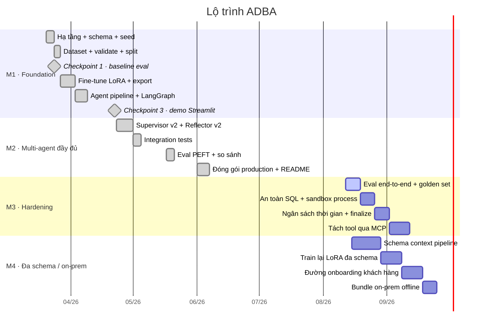

# Timeline & Roadmap — ADBA

> Lịch trình tổng thể, milestone, sprint backlog và ma trận trách nhiệm.
> Changelog thực tế (đã xảy ra) nằm ở [CHANGELOG.md](CHANGELOG.md) — file này nói về *kế hoạch*.

---

## 1. Bức tranh tổng thể

## 2. Milestone

### M1 — Foundation & demo ✅ *(hoàn thành)*

| Giai đoạn | Nội dung | Điều kiện ra |
|---|---|---|
| Hạ tầng | Docker + PostgreSQL + 3 schema + seed | DB chạy, `scripts/test_postgres_connection.py` xanh |
| Data & schema | Pydantic model + prompt template | Import không lỗi |
| Dataset | Sinh ~1.500 mẫu, validate, split | ≥ 1.200 mẫu hợp lệ |
| **Checkpoint 1** | Đo baseline model gốc | Ghi nhận số liệu → `eval/baseline_results.json` |
| Fine-tuning | LoRA ~3 epoch | Val loss giảm đều |
| Model export | Merge + `ModelClient` | **Checkpoint 2** |
| Agent pipeline | 6 agent + wiring LangGraph | ≥ 80% integration test pass |
| **Demo** | Streamlit UI + 5 truy vấn mẫu | **Checkpoint 3** |

### M2 — Multi-agent đầy đủ ✅ *(hoàn thành)*

| Giai đoạn | Nội dung | Điều kiện ra |
|---|---|---|
| Refactor agent | Tách trách nhiệm, chuẩn hoá state | `MultiAgentState` một nguồn sự thật |
| Supervisor v2 | Dependency resolver + 200 mẫu routing | Plan hợp lệ ≥ 88% |
| Insight v2 | Anomaly tool (sigma, YoY/QoQ) | Cờ bất thường xuất hiện đúng |
| Reflector v2 | Phân loại lỗi + định tuyến lại | Không còn vòng lặp vô hạn |
| Integration test | 20 truy vấn (10 đơn giản + 10 phức tạp) | `tests/integration/` xanh |
| Eval PEFT | So sánh base vs LoRA trên 98 mẫu | Ghi `training/finetuned_checkpoint50_results.json` |
| Production | `docker-compose` + CI/CD + README | Image đẩy lên GHCR |

### M3 — Hardening cho production 🔄 *(đang làm)*

Nguồn: [spec `2026-08-12`](../superpowers/specs/2026-08-12-adba-mcp-hardening-design.md).
Nguyên tắc: **MCP đi cuối cùng** — thay đổi lớn nhất, giá trị trực tiếp nhỏ nhất.

| Pha | Nội dung | Quy mô | Rollback |
|---|---|---|---|
| **3.0** | `eval/eval_e2e.py` + golden set + đo baseline kiến trúc hiện tại. Không sửa production code. | Vừa | — |
| **3.1** | Role read-only, SQL guard 3 lớp, `_extract_sql` fail-closed, `fork`→`spawn`, `ConnectionProfile` | Nhỏ | `git revert` |
| **3.2** | `deadline_ts`, node `finalize`, thang kết quả một phần, trần call, trace JSONL | Vừa | `git revert` |
| **3.3** | MCP server + handle pattern + container cô lập, sau cờ `ADBA_TOOLS_BACKEND` | Lớn | Đổi biến môi trường |

Chạy lại eval sau mỗi pha để quy trách nhiệm sạch: pha 3.1 accuracy phải **không đổi**;
pha 3.2 phải làm `p95` và `slo_hit_rate` nhảy.

### M4 — Đa schema & on-prem 📋 *(đã thiết kế, chưa khởi động)*

Nguồn: [spec `2026-08-15`](../superpowers/specs/2026-08-15-adba-multi-schema-onprem-design.md) ·
[plan chi tiết](../superpowers/plans/2026-08-15-schema-context-pipeline.md).

| Pha | Nội dung | Điều kiện ra |
|---|---|---|
| **4.0** | Harness eval tầng 1: parse SQL mẫu → tập bảng; nạp Spider/BIRD/BEAVER | Đo được recall của retriever mốc |
| **4.1** | `render_schema()` DDL, tách prompt ba đường, `SchemaContext`, tách `permitted_tables`/`retrieved_tables` | Golden set ADBA không hồi quy |
| **4.2** | Train lại LoRA đa schema | `beaver_exec_accuracy` cải thiện so với base |
| **4.3** | Đường onboarding: `extract_schema` → `annotate_schema` → `build_profile` → `verify_profile` | Chạy trọn trên một schema thứ hai |
| **4.4** | Bundle on-prem: `docker-compose.onprem.yml`, tắt egress, model ship kèm | Cài được trên máy sạch không internet |

## 3. Sprint backlog hiện tại

Sprint 2 tuần. Ưu tiên: **P0** chặn release · **P1** cần cho production · **P2** cải thiện.

### Sprint đang mở — M3.0 + M3.1

| ID | Việc | Ưu tiên | Ước tính | Điều kiện hoàn thành |
|---|---|---|---|---|
| H-01 | `eval/eval_e2e.py` chạy trọn graph, không chỉ từng skill | P0 | 3 ngày | Chạy được 20 truy vấn golden, xuất JSON có `p50/p95/slo_hit_rate` |
| H-02 | Golden set 20 truy vấn có đáp án đã kiểm tay | P0 | 2 ngày | File `eval/golden_set.jsonl` + test cố định kết quả |
| H-03 | Role `adba_readonly` trong PostgreSQL + script migration | P0 | 0,5 ngày | Test đối kháng: `INSERT` bị từ chối ở tầng DB |
| H-04 | SQL guard 3 lớp (`sqlparse`): chặn nhiều statement, DML, CTE ghi dữ liệu | P0 | 2 ngày | Bộ test đối kháng 15 ca, 0 ca lọt |
| H-05 | `_extract_sql` fail-closed — không trả chuỗi rác khi không thấy SQL | P1 | 0,5 ngày | Ném lỗi rõ ràng thay vì trả text nguyên |
| H-06 | Sandbox chuyển `fork` → `spawn`, env rỗng | P1 | 1 ngày | Test xác nhận biến môi trường không rò vào sandbox |
| H-07 | `ConnectionProfile` gom `DATABASE_URL` + `allowed_tables` + `info_box` | P1 | 2 ngày | `_ALLOWED_TABLES` tĩnh trong `sql_tool.py` biến mất |
| H-08 | Hạ timeout theo agent cho khớp SLO 45 s | P1 | 0,5 ngày | Tổng timeout xấu nhất < 60 s |

### Sprint kế tiếp — M3.2

| ID | Việc | Ưu tiên | Ước tính |
|---|---|---|---|
| H-09 | `deadline_ts` mang trong `MultiAgentState`, cấp phát theo dự trữ | P0 | 2 ngày |
| H-10 | Node `finalize` thay `END` trần — luôn trả được kết quả một phần | P0 | 2 ngày |
| H-11 | Trần cứng số lần gọi model thay cho đếm retry rải rác | P1 | 1 ngày |
| H-12 | Trace JSONL vào `logs/traces/` + chính sách xoay vòng | P1 | 1 ngày |
| H-13 | Phân loại lỗi thống nhất giữa Reflector và trace | P2 | 1 ngày |

### Backlog chưa xếp sprint

| ID | Việc | Ưu tiên | Ghi chú |
|---|---|---|---|
| B-01 | Container hoá sandbox Python (`sandbox/Dockerfile`) | P1 | File đang được `docker-compose.prod.yml` tham chiếu nhưng chưa tồn tại |
| B-02 | REST API (FastAPI) song song với Streamlit | P2 | Tiền đề cho OpenAPI — xem [API.md](../02-architecture/API.md) |
| B-03 | Hội thoại nhiều lượt có nhớ ngữ cảnh | P2 | Cần thiết kế lại vòng đời state |
| B-04 | CI chạy eval smoke + metric routing | P2 | Gắn với H-01 |
| B-05 | Deploy inference vLLM/GPU cloud + HTTPS | P2 | Chỉ cho bản SaaS, không cho on-prem |
| B-06 | `scripts/ollama-entrypoint.sh` (đang thiếu) | P1 | `docker-compose.prod.yml` tham chiếu |

## 4. RACI Matrix

Dự án hiện do một người thực hiện; các vai dưới đây là **chiếc mũ đội theo việc**, không phải
biên chế. Ghi rõ ra để khi có người thứ hai tham gia thì bàn giao được ngay.

**R** = Responsible (làm) · **A** = Accountable (chịu trách nhiệm cuối, duyệt) ·
**C** = Consulted (hỏi ý kiến trước) · **I** = Informed (báo sau)

| Hoạt động | Product Owner | Kiến trúc sư | Dev | ML Engineer | QA | DevOps |
|---|---|---|---|---|---|---|
| Xác định phạm vi & PRD | **A/R** | C | I | I | I | I |
| Thiết kế kiến trúc, viết spec | A | **R** | C | C | I | C |
| Hiện thực agent & tool | I | A | **R** | C | I | I |
| Thiết kế schema DB & seed | C | A | **R** | I | I | C |
| Sinh dataset & fine-tune | I | C | I | **R/A** | I | I |
| Thiết kế bộ metric eval | A | C | I | **R** | C | I |
| Chạy eval & báo cáo số liệu | I | C | I | **R** | A | I |
| Viết unit / integration test | I | C | R | I | **A/R** | I |
| Review code trước merge | I | **A** | R | C | C | I |
| Docker, CI/CD, môi trường | I | C | I | I | I | **R/A** |
| Cài đặt tại khách hàng (on-prem) | C | C | I | I | I | **R/A** |
| Duyệt release & gắn tag | **A** | C | R | I | C | R |
| Bảo trì tài liệu | A | R | **R** | R | I | I |

### Ai duyệt cái gì

| Loại thay đổi | Người duyệt bắt buộc |
|---|---|
| Đổi contract Pydantic (`plan_schema`, `insight_schema`) | Kiến trúc sư |
| Đổi schema DB (`data/schemas/*.sql`) | Kiến trúc sư + DevOps (migration) |
| Đổi prompt trong `prompts/` | ML Engineer (phải kèm số eval trước/sau) |
| Đổi ranh giới an toàn (SQL guard, sandbox) | Kiến trúc sư + QA, kèm test đối kháng |
| Đổi biến môi trường / compose | DevOps |
| Gắn tag phiên bản | Product Owner |

## 5. Checkpoint & phương án dự phòng

| Checkpoint | Câu hỏi phải trả lời | Nếu không đạt |
|---|---|---|
| Dataset Quality | ≥ 1.200 mẫu hợp lệ? | +1 ngày lọc tay + viết 100 mẫu chất lượng cao |
| Model Quality | SQL execution accuracy ≥ 82%? | Dùng GPT-4o cho Supervisor + SQL Agent thay model fine-tuned |
| Single-Agent Demo | Chạy được end-to-end? | Cắt Viz Agent, giữ SQL + Insight |
| Multi-Agent Gate | Multi-agent hơn single-agent? | Bàn giao bản single-agent + báo cáo kiến trúc như future work |
| **Production Gate (M3)** | `slo_hit_rate` ≥ 90%, 0 mutation chạm DB? | Không mang lên mạng khách hàng; ở lại môi trường demo |
| **On-prem Gate (M4)** | Chạy được trên máy không internet? | Giao bản SaaS nội bộ, hoãn on-prem |

## 6. Mục tiêu chất lượng

| Chỉ số | Mục tiêu | Ý nghĩa |
|---|---|---|
| SQL Execution Accuracy | ≥ 82% | Câu SQL chạy không lỗi |
| JSON Plan Valid Rate | ≥ 88% | Plan của Supervisor hợp lệ |
| Agent Routing Accuracy | ≥ 85% | Chọn đúng agent cho từng loại câu hỏi |
| End-to-End Success Rate | ≥ 75% | Câu hỏi → insight không crash |
| Insight Quality Score | ≥ 3,8/5 | Chất lượng finding + action |
| Avg Retry Count | ≤ 1,2/truy vấn | Mức ổn định của pipeline |
| Latency P50 | ≤ 25 s | Thời gian phản hồi trung vị |
| `slo_hit_rate` | ≥ 90% dưới 45 s | Tiêu chí production của M3 |

Số liệu đo được thực tế: [AGENT_ARCHITECTURE.md § Kết quả đánh giá](../03-flows/AGENT_ARCHITECTURE.md#kết-quả-đánh-giá).

---

## Phụ lục — 15 commit gần nhất (tự cập nhật)

<!-- AUTO:begin id=commit-history -->

| Commit | Ngày | Tác giả | Nội dung |
|---|---|---|---|
| `a0ccf79` | 2026-09-05 | Đặng Văn Vỹ | fix(errors): I5 dùng thật tập nhãn đóng, phát ra budget_exceeded; I7 giữ đủ trace |
| `a1542ab` | 2026-09-05 | Đặng Văn Vỹ | fix(budget): I4 dự trữ ≥ ước lượng; I6 đếm lời gọi của supervisor; I8 timeout thật |
| `b07124d` | 2026-09-05 | Đặng Văn Vỹ | fix(sql): I1 dòng chảy qua cursor phía server; I3 nói rõ role chỉ-đọc chưa được nối |
| `e1eb664` | 2026-09-05 | Đặng Văn Vỹ | fix(review): C1/C2/C3 — lượt bị cắt không còn bị gọi là success |
| `d2f7f25` | 2026-09-03 | Đặng Văn Vỹ | feat(ui): hiển thị kết quả một phần và lý do bị cắt |
| `ddaeb5a` | 2026-09-03 | Đặng Văn Vỹ | feat(trace): query_id + ngân sách trong trace, ghi JSONL; nhãn lỗi một nguồn |
| `0ba85e1` | 2026-09-03 | Đặng Văn Vỹ | feat(budget): cấp phát theo dự trữ — python/viz bị cắt trước, insight được bảo vệ |
| `71b19c6` | 2026-09-03 | Đặng Văn Vỹ | feat(graph): mọi đường ra đi qua finalize, không còn END trần |
| `eaceedf` | 2026-09-01 | Đặng Văn Vỹ | fix(graph): đóng 2 lỗ hổng present-but-wrong-shape còn sót trong finalize |
| `ac65f33` | 2026-09-01 | Đặng Văn Vỹ | fix(graph): finalize_node chịu được state None/sai kiểu, không ném lỗi |
| `fc69ccb` | 2026-09-01 | Đặng Văn Vỹ | feat(graph): node finalize — thang success/partial/failed có lý do |
| `3c96a2c` | 2026-09-01 | Đặng Văn Vỹ | feat(budget): ModelClient từ chối khởi động lời gọi không kịp deadline |
| `3e982da` | 2026-09-01 | Đặng Văn Vỹ | fix(test): remove unreachable fixture in test_supervisor.py (task 6 review) |
| `2cf725e` | 2026-09-01 | Đặng Văn Vỹ | feat(budget): trần cứng thay đếm retry — reflector 8→1, sql retry 3→2, trần 12 call |
| `6abe0cb` | 2026-09-01 | Đặng Văn Vỹ | fix(routing): conditional edge thành hàm thuần; node giữ việc ghi state (spec 5.5) |

<!-- AUTO:end id=commit-history -->

<!-- AUTO:begin id=stamp -->

| Trường | Giá trị |
|---|---|
| Commit nguồn gần nhất | `a0ccf79` — fix(errors): I5 dùng thật tập nhãn đóng, phát ra budget_exceeded; I7 giữ đủ trace |
| Tác giả | Đặng Văn Vỹ |
| Ngày commit | 2026-09-05 |
| Số commit nguồn | 119 |
| Sinh bởi | `scripts/update_docs.py` (hook `post-commit`) |

<!-- AUTO:end id=stamp -->
