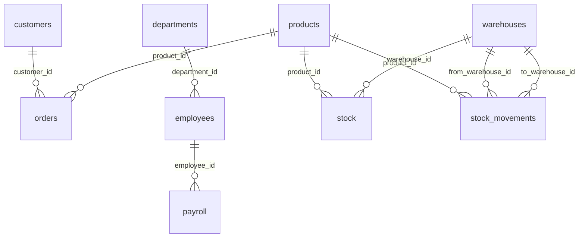
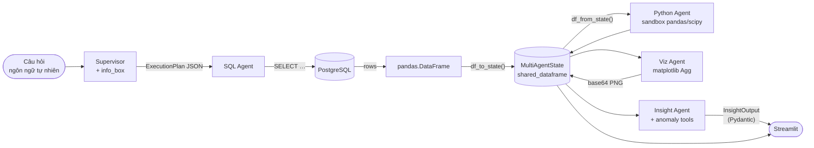
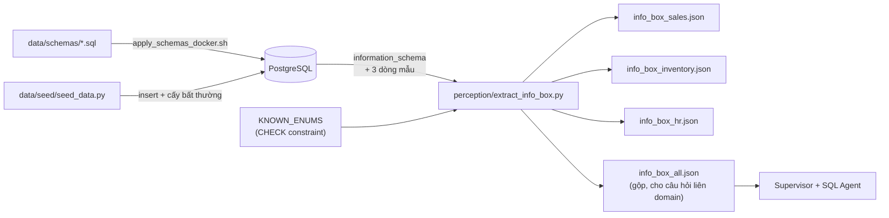
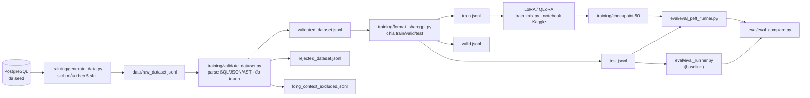

# Database & Data Pipeline Design — ADBA

> Dữ liệu nằm ở đâu, có hình dạng gì, và đi qua những bước nào.

---

## 1. Tổng quan mô hình dữ liệu

PostgreSQL 15, một database `adba_db`, ba **domain nghiệp vụ** dùng chung một namespace
`public` (không tách schema Postgres) — vì các câu hỏi thực tế thường bắc cầu giữa các domain:
"kho nào sắp hết hàng cho SKU đang bán chạy?" cần cả `sales` lẫn `inventory`.

| Domain | Bảng | Câu hỏi phục vụ |
|---|---|---|
| **sales** | `customers`, `products`, `orders` | Doanh thu, biên lợi nhuận, phân khúc khách, kênh thanh toán |
| **inventory** | `warehouses`, `stock`, `stock_movements` | Tồn kho, nguy cơ hết hàng, hàng chết, luân chuyển giữa kho |
| **hr** | `departments`, `employees`, `payroll` | Nhân sự, quỹ lương, nghỉ việc, làm thêm giờ, vượt ngân sách |

**Cầu nối liên domain**: `products.id` được cả `orders` và `stock` / `stock_movements` tham chiếu;
`region` là cột chung xuất hiện ở cả ba domain với cùng tập giá trị enum.

### ERD (sinh tự động từ khoá ngoại trong DDL)

<!-- AUTO:begin id=db-erd -->



<!-- AUTO:end id=db-erd -->

### Quy mô hiện tại

<!-- AUTO:begin id=db-rowcounts -->

| Bảng | Domain | Số dòng | Cột | FK | Index |
|---|---|---|---|---|---|
| `customers` | sales | 600 | 8 | 0 | 3 |
| `products` | sales | 80 | 8 | 0 | 3 |
| `orders` | sales | 29.830 | 14 | 2 | 6 |
| `warehouses` | inventory | 8 | 7 | 0 | 1 |
| `stock` | inventory | 441 | 8 | 2 | 4 |
| `stock_movements` | inventory | 27.580 | 10 | 3 | 5 |
| `departments` | hr | 10 | 7 | 1 | 2 |
| `employees` | hr | 250 | 12 | 1 | 6 |
| `payroll` | hr | 5.897 | 11 | 1 | 4 |
| **Tổng** | — | **64.696** | — | — | — |

<!-- AUTO:end id=db-rowcounts -->

## 2. Chi tiết từng bảng

<!-- AUTO:begin id=db-tables -->

#### Domain `hr` — `data/schemas/schema_hr.sql`

**`departments`** · 1 index

| Cột | Kiểu | Ràng buộc |
|---|---|---|
| `id` | `SERIAL` | PK |
| `name` | `VARCHAR(150)` | NOT NULL, UNIQUE |
| `region` | `VARCHAR(50)` | NOT NULL, CHECK ∈ {Miền Bắc, Miền Trung, Miền Nam, Tây Nguyên, HQ} |
| `budget` | `NUMERIC(16, 2)` | NOT NULL, CHECK `budget > 0` |
| `headcount` | `INT` | NOT NULL, CHECK `headcount >= 0` |
| `manager_id` | `INT` | — |
| `created_at` | `TIMESTAMPTZ` | NOT NULL |

**`employees`** · 5 index

| Cột | Kiểu | Ràng buộc |
|---|---|---|
| `id` | `SERIAL` | PK |
| `name` | `VARCHAR(150)` | NOT NULL |
| `email` | `VARCHAR(254)` | NOT NULL, UNIQUE |
| `department_id` | `INT` | FK → `departments.id`, NOT NULL |
| `role` | `VARCHAR(100)` | NOT NULL |
| `level` | `VARCHAR(20)` | NOT NULL, CHECK ∈ {Junior, Mid, Senior, Lead, Manager, Director, C-Level} |
| `salary` | `NUMERIC(12, 2)` | NOT NULL, CHECK `salary > 0` |
| `hire_date` | `DATE` | NOT NULL |
| `end_date` | `DATE` | — |
| `status` | `VARCHAR(20)` | NOT NULL, CHECK ∈ {active, on_leave, terminated, contractor} |
| `performance_score` | `NUMERIC(3, 1)` | CHECK `performance_score BETWEEN 1.0 AND 5.0` |
| `created_at` | `TIMESTAMPTZ` | NOT NULL |

**`payroll`** · 3 index

| Cột | Kiểu | Ràng buộc |
|---|---|---|
| `id` | `SERIAL` | PK |
| `employee_id` | `INT` | FK → `employees.id`, NOT NULL |
| `month` | `SMALLINT` | NOT NULL, CHECK `month BETWEEN 1 AND 12` |
| `year` | `SMALLINT` | NOT NULL, CHECK `year >= 2000` |
| `base_salary` | `NUMERIC(12, 2)` | NOT NULL, CHECK `base_salary > 0` |
| `bonus` | `NUMERIC(12, 2)` | NOT NULL, CHECK `bonus >= 0` |
| `deduction` | `NUMERIC(12, 2)` | NOT NULL, CHECK `deduction >= 0` |
| `overtime_hours` | `NUMERIC(5, 1)` | NOT NULL, CHECK `overtime_hours >= 0` |
| `net_salary` | `NUMERIC(12, 2)` | NOT NULL, CHECK `net_salary > 0` |
| `paid_at` | `DATE` | NOT NULL |
| `created_at` | `TIMESTAMPTZ` | NOT NULL |

#### Domain `inventory` — `data/schemas/schema_inventory.sql`

**`warehouses`** · 1 index

| Cột | Kiểu | Ràng buộc |
|---|---|---|
| `id` | `SERIAL` | PK |
| `name` | `VARCHAR(150)` | NOT NULL |
| `city` | `VARCHAR(100)` | NOT NULL |
| `region` | `VARCHAR(50)` | NOT NULL, CHECK ∈ {Miền Bắc, Miền Trung, Miền Nam, Tây Nguyên} |
| `capacity` | `INT` | NOT NULL, CHECK `capacity > 0` |
| `is_active` | `BOOLEAN` | NOT NULL |
| `created_at` | `TIMESTAMPTZ` | NOT NULL |

**`stock`** · 3 index

| Cột | Kiểu | Ràng buộc |
|---|---|---|
| `id` | `SERIAL` | PK |
| `product_id` | `INT` | FK → `products.id`, NOT NULL |
| `warehouse_id` | `INT` | FK → `warehouses.id`, NOT NULL |
| `quantity` | `INT` | NOT NULL, CHECK `quantity >= 0` |
| `min_threshold` | `INT` | NOT NULL, CHECK `min_threshold >= 0` |
| `reorder_qty` | `INT` | NOT NULL, CHECK `reorder_qty >= 0` |
| `unit_cost` | `NUMERIC(12, 2)` | NOT NULL, CHECK `unit_cost > 0` |
| `last_updated` | `TIMESTAMPTZ` | NOT NULL |

**`stock_movements`** · 5 index

| Cột | Kiểu | Ràng buộc |
|---|---|---|
| `id` | `SERIAL` | PK |
| `product_id` | `INT` | FK → `products.id`, NOT NULL |
| `from_warehouse_id` | `INT` | FK → `warehouses.id` |
| `to_warehouse_id` | `INT` | FK → `warehouses.id` |
| `quantity` | `INT` | NOT NULL, CHECK `quantity > 0` |
| `movement_date` | `DATE` | NOT NULL |
| `movement_type` | `VARCHAR(30)` | NOT NULL, CHECK ∈ {inbound, outbound, transfer, adjustment, return, write_off} |
| `reference_order_id` | `INT` | — |
| `note` | `TEXT` | — |
| `created_at` | `TIMESTAMPTZ` | NOT NULL |

#### Domain `sales` — `data/schemas/schema_sales.sql`

**`customers`** · 2 index

| Cột | Kiểu | Ràng buộc |
|---|---|---|
| `id` | `SERIAL` | PK |
| `name` | `VARCHAR(150)` | NOT NULL |
| `email` | `VARCHAR(254)` | NOT NULL, UNIQUE |
| `phone` | `VARCHAR(20)` | — |
| `city` | `VARCHAR(100)` | NOT NULL |
| `region` | `VARCHAR(50)` | NOT NULL, CHECK ∈ {Miền Bắc, Miền Trung, Miền Nam, Tây Nguyên} |
| `segment` | `VARCHAR(50)` | NOT NULL, CHECK ∈ {Enterprise, SME, Retail, Government} |
| `created_at` | `TIMESTAMPTZ` | NOT NULL |

**`products`** · 2 index

| Cột | Kiểu | Ràng buộc |
|---|---|---|
| `id` | `SERIAL` | PK |
| `name` | `VARCHAR(200)` | NOT NULL |
| `sku` | `VARCHAR(50)` | NOT NULL, UNIQUE |
| `category` | `VARCHAR(100)` | NOT NULL, CHECK ∈ {Electronics, Office Supplies, Furniture, Industrial, Food & Beverage, Apparel} |
| `unit_price` | `NUMERIC(12, 2)` | NOT NULL, CHECK `unit_price > 0` |
| `cost` | `NUMERIC(12, 2)` | NOT NULL, CHECK `cost > 0` |
| `is_active` | `BOOLEAN` | NOT NULL |
| `created_at` | `TIMESTAMPTZ` | NOT NULL |

**`orders`** · 6 index

| Cột | Kiểu | Ràng buộc |
|---|---|---|
| `id` | `SERIAL` | PK |
| `customer_id` | `INT` | FK → `customers.id`, NOT NULL |
| `product_id` | `INT` | FK → `products.id`, NOT NULL |
| `region` | `VARCHAR(50)` | NOT NULL, CHECK ∈ {Miền Bắc, Miền Trung, Miền Nam, Tây Nguyên} |
| `quantity` | `INT` | NOT NULL, CHECK `quantity > 0` |
| `unit_price` | `NUMERIC(12, 2)` | NOT NULL, CHECK `unit_price > 0` |
| `discount_rate` | `NUMERIC(5, 4)` | NOT NULL, CHECK `discount_rate >= 0 AND discount_rate < 1` |
| `amount` | `NUMERIC(14, 2)` | NOT NULL, CHECK `amount >= 0` |
| `order_date` | `DATE` | NOT NULL |
| `quarter` | `SMALLINT` | GENERATED (không ghi trực tiếp), NOT NULL |
| `year` | `SMALLINT` | GENERATED (không ghi trực tiếp), NOT NULL |
| `status` | `VARCHAR(20)` | NOT NULL, CHECK ∈ {pending, processing, completed, cancelled, refunded} |
| `payment_method` | `VARCHAR(30)` | NOT NULL, CHECK ∈ {bank_transfer, cash, credit_card, e_wallet} |
| `created_at` | `TIMESTAMPTZ` | NOT NULL |

<!-- AUTO:end id=db-tables -->

### Vì sao schema trông như vậy

| Quyết định | Lý do |
|---|---|
| `orders.quarter` / `orders.year` là `GENERATED ALWAYS ... STORED` | Câu hỏi BI hầu như luôn `GROUP BY` theo kỳ; cột stored cho index dùng được thay vì phải tính `EXTRACT` mỗi lần. **Hệ quả**: không được ghi trực tiếp — prompt `text_to_sql.txt` nêu rõ điều này |
| `orders.region` lặp lại dù suy ra được từ `customers` | Denormalize có chủ đích: bỏ được một join khỏi truy vấn phổ biến nhất. Đổi lại phải giữ nhất quán lúc seed |
| Enum bằng `CHECK` chứ không phải bảng tra cứu | `information_schema` không phơi giá trị CHECK ra, nên `perception/extract_info_box.py` giữ một bản `KNOWN_ENUMS` để bơm vào `info_box`. Đây là điểm phải sửa hai chỗ khi đổi enum |
| `products.chk_margin` (`unit_price > cost`) | Ràng buộc nghiệp vụ ở tầng DB — không có sản phẩm bán lỗ *theo giá niêm yết*; lỗ chỉ xảy ra qua `discount_rate` (chính là bất thường S2) |
| Partial index `idx_orders_completed` (`WHERE status IN ('completed','processing')`) | Mọi câu hỏi doanh thu đều lọc bỏ đơn huỷ/hoàn tiền; partial index nhỏ và nhanh hơn index đầy đủ |
| `departments.manager_id` FK gắn sau `employees` | Vòng tham chiếu departments ↔ employees; phải tạo bảng trước rồi mới thêm ràng buộc |

## 3. Dữ liệu seed và các bất thường được cấy sẵn

`data/seed/seed_data.py` sinh dữ liệu tiếng Việt bằng Faker với `SEED = 42` (tái lập được),
trải trên khoảng thời gian **2022-01-01 → 2024-12-31**, phân bố doanh thu theo vùng có trọng số.

Điểm quan trọng: dữ liệu **không phẳng**. Script cấy sẵn một danh mục bất thường có chủ ý —
đây chính là thứ để kiểm chứng Insight Agent có thực sự phát hiện được hay chỉ mô tả lại số liệu.
Vài bất thường còn **tương quan chéo domain** (ví dụ S1 đi kèm I2 và H4), nên câu trả lời tốt
phải nối được ba domain lại.

<!-- AUTO:begin id=anomalies -->

| ID | Domain | Tên | Loại | Mô tả |
|---|---|---|---|---|
| `S1` | sales | Revenue spike March 2024 (Miền Bắc) | positive_outlier | Mega B2B campaign drives +280% revenue in Miền Bắc during March 2024.  Only Enterprise segment. Correlated with I2 (stockout) and H4 (overtime). |
| `S2` | sales | Negative-margin product ELEC-007 | negative | SKU ELEC-007 sold with discount_rate so high that effective price < cost  from Q2 2024 onward. Represents a pricing mistake. |
| `S3` | sales | Enterprise churn Q3 2024 | negative | 20 Enterprise customers place no orders after July 1 2024.  They contributed ~15% of 2023 revenue. |
| `S4` | sales | Refund surge November 2023 (Electronics) | negative | Refund rate for Electronics category hits 3.4× baseline in Nov 2023.  Simulates a defective batch. |
| `S5` | sales | Payment method shift to e-wallet Q2 2024 | structural | e_wallet share grows from ~5% to ~35% of orders from Q2 2024 onward. |
| `I1` | inventory | Stockout risk — 6 SKUs below min_threshold | negative | 6 products have quantity < min_threshold at ≥1 warehouse. |
| `I2` | inventory | Dead stock — 8 SKUs not sold in 180 days | warning | 8 products show inbound but no outbound in last 180 days. |
| `I3` | inventory | Write-off spike Q4 2023 (Tây Nguyên) | negative | write_off movements 5× baseline at Tây Nguyên warehouse Q4 2023. |
| `I4` | inventory | Inventory-Sales mismatch (Miền Bắc Q4 2024) | structural | Outbound movements increase in Miền Bắc Q4 2024 but stock snapshot  does not decrease proportionally — missing inbound records. |
| `I5` | inventory | Transfer loop Bắc ↔ Trung | warning | Same SKUs transferred Bắc→Trung then back Trung→Bắc within 30 days. |
| `H1` | hr | Bonus outliers — 4 employees | structural | 4 employees receive bonus > 3σ vs. same-level peers.  2 justified by high performance_score, 2 unexplained. |
| `H2` | hr | Attrition cluster Q2 2024 (Tech dept) | negative | 15 employees terminated in Q2 2024, 12 from Tech department.  Correlates with S3 enterprise churn. |
| `H3` | hr | Salary inversion — 3 manager/report pairs | warning | 3 pairs where manager.salary < their Senior direct report.salary. |
| `H4` | hr | Overtime surge Sales team March 2024 | positive | payroll.overtime_hours for Sales dept employees averages 4×  baseline in March 2024. Directly correlated with S1 revenue spike. |
| `H5` | hr | Budget overrun Finance dept Q3 2024 | negative | SUM(payroll.net_salary) for Finance > departments.budget  for 3 consecutive months in Q3 2024. |

<!-- AUTO:end id=anomalies -->

Kiểm chứng bằng SQL: `scripts/verify_anomalies.sql`.

## 4. Data Flow Diagram

### 4.1 Đường dữ liệu vận hành (lúc trả lời câu hỏi)



Bốn phép biến đổi định dạng, mỗi phép có một chỗ hỏng riêng:

| Bước | Từ → đến | Hàm | Hỏng thế nào |
|---|---|---|---|
| Truy vấn | SQL text → `DataFrame` | `execute_sql()` | Lỗi cú pháp/schema → Reflector |
| Serialize | `DataFrame` → dict | `df_to_state()` | Kiểu không JSON hoá được (Decimal, date) |
| Khôi phục | dict → `DataFrame` | `df_from_state()` | Mất dtype → phép tính sai kiểu |
| Trình bày | `DataFrame` → PNG base64 | `generate_chart()` | Chọn sai kiểu biểu đồ, nhãn quá dài |

### 4.2 Đường ngữ cảnh schema (chạy ngoại tuyến, trước khi phục vụ)



`info_box` là **ngữ cảnh DB duy nhất** mà agent nhìn thấy. Nó phải đồng thời:

- Đủ **nhỏ** để vừa context 4096 token cùng câu hỏi, plan và lịch sử hành động.
- Đủ **giàu** để model không phải đoán tên cột, kiểu, quan hệ hay giá trị enum.

Mỗi bảng trong `info_box` gồm: `table_name`, `row_count`, `primary_key`, danh sách `columns`
(tên, kiểu, nullable, `is_generated`, `default`, `enum_values`), `foreign_keys`, `indexes`,
và `sample_rows` (3 dòng).

> ⚠️ **Đổi schema thì phải chạy lại `extract_info_box.py`.** Bỏ bước này, agent viết SQL theo
> schema cũ và lỗi ở tầng thực thi — Reflector sẽ quay vòng mà không bao giờ sửa được.

> ⚠️ `sample_rows` chứa dữ liệu thật. Với triển khai on-prem, spec đa schema yêu cầu **không**
> có `sample_rows` trong profile của khách hàng.

### 4.3 Đường dữ liệu huấn luyện



<!-- AUTO:begin id=datasets -->

| File | Số mẫu | Kích thước | Vai trò | Phân bố skill |
|---|---|---|---|---|
| `data/golden_vi.jsonl` | 20 | 4 KB | — | — |
| `data/long_context_excluded.jsonl` | 28 | 711 KB | Mẫu vượt 4096 token — loại để không cắt cụt lúc train | text-to-sql (28) |
| `data/supervisor_routing_samples.jsonl` | 200 | 1.5 MB | Mẫu routing bổ sung cho Supervisor v2 | supervisor-routing (200) |
| `data/test.jsonl` | 98 | 725 KB | Tập kiểm thử — dùng bởi `eval/eval_runner.py` | text-to-sql (32), data-analysis (30), supervisor-routing (18), insight-generation (14), error-reflection (4) |
| `data/train.jsonl` | 787 | 5.6 MB | Tập huấn luyện LoRA | text-to-sql (251), data-analysis (238), supervisor-routing (143), insight-generation (118), error-reflection (37) |
| `data/valid.jsonl` | 99 | 721 KB | Tập validation (theo dõi val loss) | text-to-sql (31), data-analysis (30), supervisor-routing (18), insight-generation (15), error-reflection (5) |

<!-- AUTO:end id=datasets -->

> Bảng trên chỉ liệt kê file **được git theo dõi**. Ba file trung gian
> (`raw_dataset.jsonl`, `validated_dataset.jsonl`, `rejected_dataset.jsonl`) nằm trong
> `.gitignore` — dựng lại được bằng `training/generate_data.py` + `training/validate_dataset.py`.

Ba cửa lọc trong `validate_dataset.py`, theo thứ tự: **đúng cú pháp** (SQL parse được, JSON parse
được, Python qua `ast.parse`), **đúng contract** (plan/insight validate qua Pydantic), **đủ ngắn**
(vượt 4096 token thì loại — huấn luyện trên mẫu bị cắt cụt dạy model sinh output cụt).

## 5. Vòng đời & vận hành dữ liệu

### Dựng lại từ đầu

```bash
docker compose down -v                  # ⚠️ xoá volume — mất toàn bộ dữ liệu
docker compose up -d postgres
./scripts/apply_schemas_docker.sh       # DDL theo thứ tự: sales → inventory → hr
python data/seed/seed_data.py           # ~64.000 dòng, SEED=42 nên tái lập được
python perception/extract_info_box.py   # bắt buộc
python scripts/test_postgres_connection.py
```

Thứ tự áp DDL không đổi được: `inventory` tham chiếu `products` (sales), `hr` độc lập
nhưng có vòng `departments ↔ employees` cần xử lý sau.

### Sao lưu

`data/adba_eval_backup.sql` là bản dump dùng cho eval — giữ để kết quả đánh giá so sánh được
giữa các lần chạy. Không dùng làm bản sao lưu production.

### Quyền truy cập (hiện tại và kế hoạch)

| | Hiện tại | Kế hoạch M3.1 |
|---|---|---|
| Role kết nối | `adba_user` — đọc/ghi đầy đủ | `adba_readonly` cho đường phục vụ; `adba_user` chỉ để seed |
| Chặn câu lệnh ghi | Chỉ dựa vào việc prompt yêu cầu SELECT | SQL guard 3 lớp bằng `sqlparse` + quyền ở tầng DB |
| Giới hạn bảng | Whitelist tĩnh trong `graph/tools/sql_tool.py` (chỉ áp cho `get_table_sample`) | `ConnectionProfile.permitted_tables` sinh từ introspection |
| Timeout | `SET LOCAL statement_timeout` = `SQL_TIMEOUT_MS` (30 s) | Giữ nguyên, thêm ngân sách toàn cục |

---

<!-- AUTO:begin id=stamp -->

| Trường | Giá trị |
|---|---|
| Commit nguồn gần nhất | `e944c52` — fix(finalize): kết quả SQL bị cắt ở trần dòng không còn được báo "success" |
| Tác giả | Đặng Văn Vỹ |
| Ngày commit | 2026-09-05 |
| Số commit nguồn | 124 |
| Sinh bởi | `scripts/update_docs.py` (hook `post-commit`) |

<!-- AUTO:end id=stamp -->
