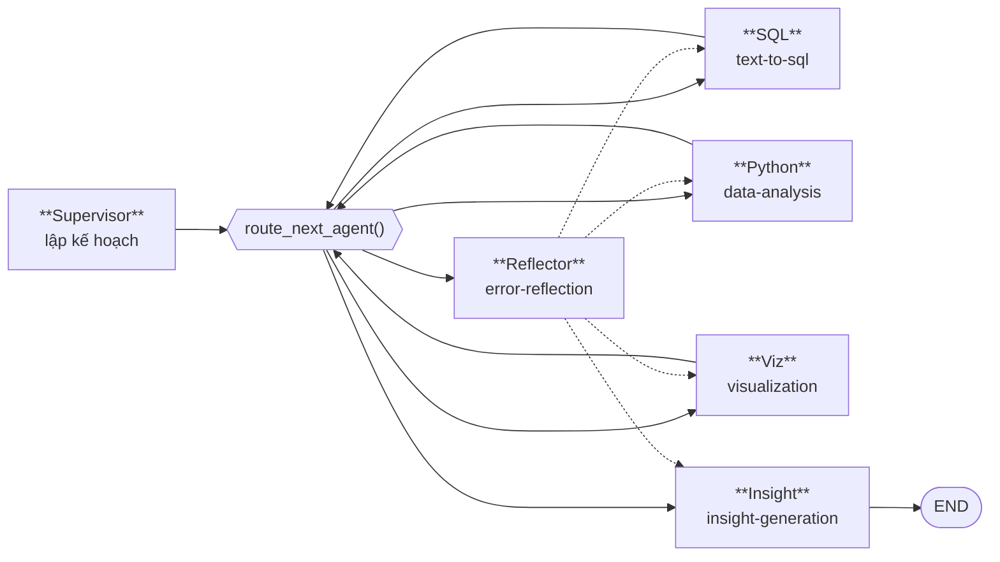

# Model & Agent Architecture — ADBA

> Pipeline AI: chiến lược prompting, state của LangGraph, fine-tuning, và bộ metric đánh giá.

---

## 1. Sáu agent



| Agent | Đầu vào | Đầu ra | Contract |
|---|---|---|---|
| **Supervisor** | `query` + `info_box` | `execution_plan`, `dependency_graph`, `ready_agents` | `ExecutionPlan` (Pydantic) |
| **SQL** | `task` từ plan + `info_box` | `shared_dataframe`, `sql_result` | SQL chạy được trên Postgres |
| **Python** | `shared_dataframe` + `task` | `shared_dataframe` (đã biến đổi), `python_result` | Code qua `ast.parse`, kết quả là DataFrame |
| **Viz** | `shared_dataframe` + `task` | `chart_b64`, `chart_metadata` | PNG base64 |
| **Insight** | Toàn bộ kết quả + thống kê | `insight` | `InsightOutput` (Pydantic) |
| **Reflector** | `last_error` + task lỗi | `shared_metadata.reflector_diagnosis` | JSON 4 khoá |

### Tham số theo agent

<!-- AUTO:begin id=agents -->

| Agent | Node LangGraph | Prompt | Retry nội bộ | Temperature | Max tokens | Timeout (s) |
|---|---|---|---|---|---|---|
| `insight` | `insight_agent_node()` | `prompts/insight_generation.txt` | — | 0.2 | 512 | 200 |
| `python` | `python_agent_node()` | `prompts/data_analysis.txt` | 2 | 0.1 | 1024 | 200 |
| `reflector` | `reflector_agent_node()` | inline (trong file agent) | — | 0.1 | 512 | 120 |
| `sql` | `sql_agent_node()` | `prompts/text_to_sql.txt` | 3 | 0.0 | 1024 | 200 |
| `supervisor` | `supervisor_node()` | `prompts/supervisor_routing.txt` | — | 0.1 | 800 | 300 |
| `viz` | `viz_agent_node()` | `prompts/viz_generation.txt` | 2 | 0.2 | 1024 | 150 |

<!-- AUTO:end id=agents -->

Logic đằng sau các con số:

- **temperature 0.0 cho SQL** — với một schema và một câu hỏi, chỉ có một câu SQL đúng. Sáng tạo ở
  đây chỉ tạo ra lỗi.
- **0.1 cho Supervisor và Reflector** — cần bám cấu trúc JSON, nhưng chút linh hoạt giúp thoát khỏi
  cách diễn giải kẹt.
- **0.2 cho Viz và Insight** — phần duy nhất người dùng đọc như văn xuôi; quá cứng thì insight
  nghe như bản mẫu điền chỗ trống.
- **timeout Supervisor cao nhất (300 s)** — plan là JSON dài nhất và chạy trước, sai là hỏng cả chuỗi.
- **max_tokens Insight thấp nhất (512)** — contract vốn ép một câu finding + 2–3 evidence; cho thêm
  chỗ chỉ khuyến khích model viết dài.

## 2. Chiến lược prompting

### Bố cục chung của prompt

Cả năm file prompt theo cùng một khung, và thứ tự các mục là có chủ ý:

```
## ROLE          — vai trò hẹp, một việc duy nhất
## SCHEMA/CONTEXT— {info_box} hoặc dữ liệu đầu vào
## RULES         — ràng buộc cứng, viết dưới dạng cấm đoán cụ thể
## OUTPUT FORMAT — mẫu JSON/SQL/code chính xác
## EXAMPLES      — vài mẫu few-shot
## NOW GENERATE  — chốt lượt
```

<!-- AUTO:begin id=prompts -->

| File | Dòng | Kích thước | Placeholder được thay lúc chạy |
|---|---|---|---|
| `prompts/data_analysis.txt` | 108 | 3.3 KB | `{columns}`, `{sample}`, `{task}` |
| `prompts/insight_generation.txt` | 143 | 5.4 KB | `{anomalies}`, `{chart_description}`, `{query}`, `{sql}`, `{stats}` |
| `prompts/supervisor_routing.txt` | 150 | 5.2 KB | `{query}`, `{schema}` |
| `prompts/text_to_sql.txt` | 35 | 1.4 KB | `{few_shots}`, `{schema}`, `{task}` |
| `prompts/viz_generation.txt` | 82 | 2.7 KB | `{columns}`, `{sample}`, `{task}` |

<!-- AUTO:end id=prompts -->

### Bốn kỹ thuật đang dùng

**1. Ràng buộc phủ định cụ thể, không phải lời khuyên chung.**
`prompts/text_to_sql.txt` không viết "hãy cẩn thận với tên cột" mà viết:

> `orders` **KHÔNG** có cột `month`. Dùng `EXTRACT(MONTH FROM order_date)`.

Ba quy tắc đầu tiên trong file đó đều sinh ra từ lỗi quan sát được lúc eval, không phải phỏng đoán.

**2. Bơm schema theo thời gian chạy.** `{info_box}` được thay bằng JSON thật ngay trước khi gọi:

```python
system_prompt = SQL_SYSTEM_PROMPT.replace("{info_box}", json.dumps(info_box, ensure_ascii=False))
```

Prompt vì thế không hardcode tên bảng, và đổi schema không phải sửa prompt. *(Còn một số ví dụ
few-shot nhắc tên bảng ADBA — dọn nốt là việc của M4.1.)*

**3. Đưa lỗi trở lại vào prompt.** SQL Agent nối lỗi của lần trước vào lượt sau:

```
Previous attempt failed with error:
ERROR: column "month" does not exist
Fix the error and rewrite the SQL.
```

Và nếu Reflector đã chẩn đoán thì thêm `[HINT from error diagnosis] …`. Model được thấy đúng
thứ nó cần để sửa, thay vì đoán lại từ đầu.

**4. Contract nằm ngoài prompt.** Prompt *mô tả* định dạng, Pydantic *cưỡng chế* định dạng.
Không tin vào việc "model sẽ nghe lời": mọi output JSON đều đi qua validate, sai thì retry.

## 3. LangGraph — state và định tuyến

### State

`MultiAgentState` là `TypedDict` phẳng, JSON-serialize được (xem [API.md](../02-architecture/API.md#12-multiagentstate--cấu-trúc-trả-về)
cho danh sách trường đầy đủ, tự cập nhật).

Ba nhóm quan trọng:

| Nhóm | Trường | Vai trò |
|---|---|---|
| Điều phối | `execution_plan`, `dependency_graph`, `ready_agents`, `completed_agents` | Router đọc để quyết định bước tiếp |
| Truyền dữ liệu | `shared_dataframe`, `shared_metadata`, `agent_outputs` | Kênh giao tiếp giữa các agent |
| Xử lý lỗi | `error_count`, `agent_error_counts`, `last_error` | Đầu vào cho Reflector và trần chống lặp |

**Vì sao DataFrame phải serialize.** LangGraph checkpoint state, và UI đọc trace sau khi chạy.
Truyền tham chiếu pandas sẽ phá cả hai. `df_to_state()` giữ `records` + `columns` + `dtypes` +
`shape`; `df_from_state()` khôi phục và **cố** ép lại dtype (bỏ qua khi ép không được — đây là
chỗ dtype có thể trôi giữa các bước).

### Định tuyến

`route_next_agent()` chạy sau **mỗi** node, không đi theo danh sách cứng:

1. `status ∈ {failed, success}` → END.
2. Validate lại DAG (`validate_dependency_graph`) — plan hỏng thì END ngay, không chạy tiếp.
3. Với mỗi agent chưa xong, kiểm xem nó có đang kẹt không (`status == "error"` hoặc
   `error_count ≥ 3`) → cân nhắc gọi Reflector hoặc chặn bước đó.
4. `resolve_ready_agents()` trả **toàn bộ** agent đã thoả phụ thuộc, theo thứ tự `step`.
5. Hiện dispatch agent đầu tiên; `state["ready_agents"]` và `shared_metadata["parallel_ready"]`
   đã sẵn sàng cho dispatch song song sau này.

`insight → END` là cạnh cứng: insight luôn là bước kết thúc, cưỡng chế ở cả hai nơi — cạnh
LangGraph và validator của `ExecutionPlan`.

Chi tiết vòng self-repair: [SEQUENCE_DIAGRAMS.md § 4](SEQUENCE_DIAGRAMS.md#4-vòng-self-repair--sql-lỗi).

## 4. Model & fine-tuning

### Model nền

| | |
|---|---|
| Base | `Qwen/Qwen2.5-Coder-7B-Instruct` |
| Phục vụ | Ollama — `qwen2.5-coder:7b-instruct-q5_K_M` (lượng tử hoá Q5_K_M) |
| Context | 4096 token (`OLLAMA_NUM_CTX`) |
| Dự phòng | `llama3.1:8b-instruct-q4_K_M` (`BACKUP_MODEL`) |
| Merged weights | [`dangvanvy/adba-qwen-merged`](https://huggingface.co/dangvanvy/adba-qwen-merged) |

Chọn bản Coder vì bốn trong sáu agent sinh ra **mã hoặc JSON có cấu trúc** (SQL, pandas,
matplotlib, plan JSON) — đúng thứ model code được huấn luyện để làm.

### Dữ liệu huấn luyện

Năm skill, sinh từ chính schema và dữ liệu thật của dự án
(xem [DATA_DESIGN.md § 4.3](../02-architecture/DATA_DESIGN.md#43-đường-dữ-liệu-huấn-luyện)):

| Skill | Học cái gì |
|---|---|
| `text-to-sql` | Câu hỏi tiếng Việt/Anh → SQL PostgreSQL đúng schema ADBA |
| `data-analysis` | Task → code pandas chạy được trong sandbox hạn chế |
| `visualization` | Task + hình dạng dữ liệu → code matplotlib |
| `insight-generation` | Kết quả + thống kê → JSON đúng `InsightOutput` |
| `supervisor-routing` | Câu hỏi → `ExecutionPlan` JSON hợp lệ |
| `error-reflection` | Lỗi → JSON chẩn đoán 4 khoá |

### Siêu tham số LoRA

| Tham số | Giá trị (PEFT, `training/checkpoint-50`) | Giá trị (MLX, `training/mlx_config.yaml`) |
|---|---|---|
| Rank `r` | 16 | `lora_layers: 16` |
| `lora_alpha` | 32 | — |
| `lora_dropout` | 0,05 | — |
| Target modules | `q,k,v,o_proj` + `gate,up,down_proj` (toàn bộ attention + MLP) | — |
| Learning rate | — | `2e-4` |
| Batch size | — | 2 |
| Iterations | 50 step (1 epoch) | 1200 |
| Max seq length | — | 2048 |
| Train on completion only | — | `true` |

Hai đường huấn luyện song song vì hai loại phần cứng: **MLX** cho Apple Silicon (phát triển cục bộ),
**PEFT/QLoRA** cho GPU NVIDIA (Kaggle T4×2, RTX 5090, RTX 5060 Ti) — xem các notebook trong `training/`.

Val loss ở checkpoint-50: **0,195** (từ ~0,367 lúc bắt đầu) — giảm đều, chưa có dấu hiệu overfit
ở mức 1 epoch.

## 5. Bộ metric đánh giá

### Cách đo

| Runner | Đo cái gì |
|---|---|
| `eval/eval_runner.py` | Model gốc qua Ollama trên `data/test.jsonl` |
| `eval/eval_peft_runner.py` | Model + adapter LoRA (`--adapter training/checkpoint-50`) |
| `eval/eval_compare.py` | So sánh hai file kết quả |

```bash
PYTHONPATH=. python eval/eval_runner.py --limit 10
PYTHONPATH=. python eval/eval_peft_runner.py --adapter training/checkpoint-50 --limit 10
PYTHONPATH=. python eval/eval_compare.py
```

### Định nghĩa metric

| Metric | Cách chấm |
|---|---|
| `sql_execution_accuracy` | Chạy `EXPLAIN` trên PostgreSQL thật — qua nghĩa là SQL hợp lệ với schema |
| `sql_heuristic_accuracy` | Kiểm cấu trúc: có `SELECT`, có `FROM`, không có DML |
| `python_syntax_rate` | `ast.parse` + có tham chiếu `df` + tuân thủ giao kèo import |
| `supervisor_json_rate` | Validate qua `ExecutionPlan` (gồm cả kiểm DAG) |
| `insight_json_rate` | Validate qua `InsightOutput` (gồm cả ràng buộc một câu, phải có số) |
| `reflector_json_rate` | Có đủ 4 khoá bắt buộc |
| `overall_json_valid_rate` | Trung bình các tác vụ sinh JSON |
| `avg_latency_s` | Thời gian suy luận trung bình mỗi mẫu |

**Điểm mạnh của bộ metric này**: `sql_execution_accuracy` chấm bằng database thật, không so chuỗi.
**Điểm yếu đã biết**: đo *từng skill rời*, không đo pipeline chạy trọn. Một hệ có mọi skill 95%
vẫn có thể hỏng end-to-end. Đây chính là lý do M3.0 xây `eval/eval_e2e.py` với bộ metric khác:
`answer_accuracy`, `p50/p95`, `slo_hit_rate`, `partial_rate`.

### Kết quả đánh giá

<!-- AUTO:begin id=metrics -->

| Metric | Baseline | Fine-tuned (LoRA ckpt-50) | Chênh lệch | Mục tiêu |
|---|---|---|---|---|
| SQL Execution Accuracy | — | 96.9% | — | ≥82% |
| SQL Heuristic Accuracy | — | 100.0% | — | — |
| Python Syntax Rate | — | 100.0% | — | ≥90% |
| Supervisor JSON Valid | — | 100.0% | — | ≥88% |
| Insight JSON Valid | — | 92.9% | — | ≥88% |
| Reflector JSON Valid | — | 100.0% | — | — |
| Overall JSON Valid | — | 97.2% | — | ≥88% |
| Latency trung bình / mẫu | — | 12.42s | — | — |

- **Fine-tuned** — `Qwen/Qwen2.5-Coder-7B-Instruct + LoRA:checkpoint-50`, 98 mẫu, chạy 2026-05-19T12:44:09

<!-- AUTO:end id=metrics -->

Ba điều đáng đọc kỹ:

1. **SQL execution 84,4% → 96,9%** là mức tăng lớn nhất. Fine-tune dạy được model đúng *phương ngữ
   của schema này* — cột GENERATED, enum tiếng Việt, quy ước lọc trạng thái đơn.
2. **Latency 75,8 s → 12,4 s** không phải công của fine-tune mà của phần cứng: baseline chạy Ollama
   trên máy cá nhân, PEFT chạy trên GPU CUDA. **Không được đọc hai con số này như so sánh model.**
3. **`insight_json_rate` đứng yên ở 92,9%** — ràng buộc "một câu + phải có số + động từ hành động"
   là thứ khó dạy bằng 50 step. Đây là chỗ có dư địa cải thiện rõ nhất.

## 6. Kiểm thử

<!-- AUTO:begin id=tests -->

| File | Số test |
|---|---|
| `tests/fixtures/mini_schema.py` | 0 |
| `tests/integration/test_complex_queries.py` | 10 |
| `tests/integration/test_onboard_flow.py` | 3 |
| `tests/integration/test_schema_context_wiring.py` | 6 |
| `tests/integration/test_simple_queries.py` | 10 |
| `tests/integration/test_tier2_executor.py` | 10 |
| `tests/unit/test_annotate.py` | 38 |
| `tests/unit/test_annotations.py` | 32 |
| `tests/unit/test_connection_profile.py` | 16 |
| `tests/unit/test_describe_dataset.py` | 6 |
| `tests/unit/test_egress_boundary.py` | 13 |
| `tests/unit/test_fetch_dataset.py` | 25 |
| `tests/unit/test_insight_agent.py` | 7 |
| `tests/unit/test_introspect.py` | 16 |
| `tests/unit/test_load_sqlite_to_postgres.py` | 46 |
| `tests/unit/test_onboard_cli.py` | 45 |
| `tests/unit/test_onboard_refresh.py` | 5 |
| `tests/unit/test_onboard_verify.py` | 20 |
| `tests/unit/test_profile_store.py` | 24 |
| `tests/unit/test_prompts_are_schema_agnostic.py` | 6 |
| `tests/unit/test_python_agent.py` | 14 |
| `tests/unit/test_reflector.py` | 3 |
| `tests/unit/test_render_schema.py` | 29 |
| `tests/unit/test_retrieval.py` | 20 |
| `tests/unit/test_review_state.py` | 21 |
| `tests/unit/test_schema_context.py` | 12 |
| `tests/unit/test_schema_model.py` | 7 |
| `tests/unit/test_sql_agent.py` | 18 |
| `tests/unit/test_sql_identifiers.py` | 12 |
| `tests/unit/test_sql_tables.py` | 21 |
| `tests/unit/test_sql_tool_guard.py` | 19 |
| `tests/unit/test_sqlite_dialect.py` | 18 |
| `tests/unit/test_supervisor.py` | 16 |
| `tests/unit/test_tier1_recall.py` | 9 |
| `tests/unit/test_tier2_execution.py` | 37 |
| `tests/unit/test_viz_agent.py` | 11 |
| **Tổng** | **605** |

<!-- AUTO:end id=tests -->

| Loại | Phụ thuộc | Chạy trên CI |
|---|---|---|
| `tests/unit/` | Mock `ModelClient`, không cần DB | ✅ |
| `tests/integration/` | Cần PostgreSQL đã seed + Ollama | ❌ (chạy tay) |

## 7. Hướng phát triển

| Hướng | Nội dung | Nguồn |
|---|---|---|
| Eval end-to-end | Đo cả pipeline, không chỉ từng skill | [spec hardening § 6](../superpowers/specs/2026-08-12-adba-mcp-hardening-design.md) |
| Schema context động | Retrieval bảng theo câu hỏi thay vì nhét cả `info_box` — điều kiện để chạy trên schema hàng trăm bảng | [plan schema context](../superpowers/plans/2026-08-15-schema-context-pipeline.md) |
| Train lại đa schema | Model chung cho mọi khách hàng, không fine-tune riêng từng bên | [spec đa schema § 2.1](../superpowers/specs/2026-08-15-adba-multi-schema-onprem-design.md) |
| Dispatch song song | `ready_agents` đã sẵn; cần state reducer cho ghi đồng thời | — |
| Prompt không phụ thuộc schema | Bỏ nốt tên bảng ADBA khỏi few-shot | M4.1 |

---

<!-- AUTO:begin id=stamp -->

| Trường | Giá trị |
|---|---|
| Commit nguồn gần nhất | `40c7214` — docs(eval): kết quả lượt đo tầng 2 đầu tiên, gồm phép quét k |
| Tác giả | Đặng Văn Vỹ |
| Ngày commit | 2026-09-03 |
| Số commit nguồn | 106 |
| Sinh bởi | `scripts/update_docs.py` (hook `post-commit`) |

<!-- AUTO:end id=stamp -->
