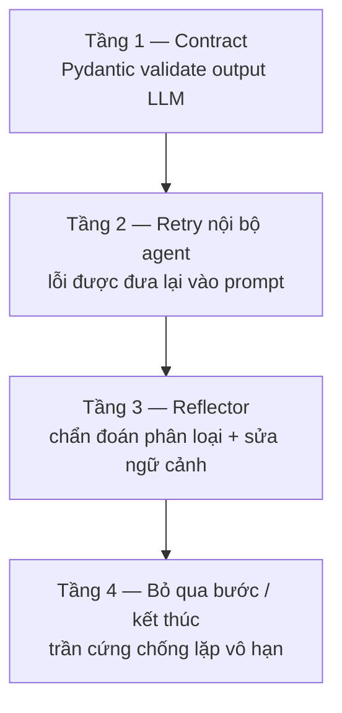

# Business Logic & Rules — ADBA

> Quy tắc nghiệp vụ, trường hợp biên, và chiến lược xử lý lỗi.
> Đây là tài liệu để tra khi cần giải thích *"vì sao con số này ra như vậy"*.

---

## 1. Quy tắc nghiệp vụ theo domain

### 1.1 Sales

| ID | Quy tắc | Cưỡng chế ở đâu |
|---|---|---|
| BR-S1 | **Doanh thu chỉ tính đơn `completed` và `processing`.** Đơn `cancelled` và `refunded` không phải doanh thu; `pending` chưa chắc chắn | `prompts/text_to_sql.txt` quy tắc 3; partial index `idx_orders_completed` |
| BR-S2 | `orders.amount` là số tiền **sau chiết khấu** — không nhân lại với `discount_rate` | Ràng buộc lúc seed |
| BR-S3 | Biên lợi nhuận = `orders.amount − products.cost × quantity`. Giá niêm yết luôn > giá vốn (`chk_margin`), nên lỗ chỉ đến từ chiết khấu | DDL `products` |
| BR-S4 | Kỳ báo cáo dùng `orders.quarter` / `orders.year` (cột GENERATED), không tự `EXTRACT` | `prompts/text_to_sql.txt` quy tắc 1, 2 |
| BR-S5 | `orders.region` là vùng của **đơn hàng**, có thể khác vùng của khách. Câu hỏi "doanh thu theo vùng" mặc định hiểu là vùng đơn hàng | Denormalize có chủ đích trong schema |
| BR-S6 | Bốn vùng cố định: `Miền Bắc`, `Miền Trung`, `Miền Nam`, `Tây Nguyên`. Không có "North/South" | CHECK constraint → `info_box.enum_values` |

### 1.2 Inventory

| ID | Quy tắc | Cưỡng chế ở đâu |
|---|---|---|
| BR-I1 | **Nguy cơ hết hàng** := `stock.quantity < stock.min_threshold` | Truy vấn; xem `scripts/verify_anomalies.sql` |
| BR-I2 | **Hàng chết** := có nhập kho nhưng không có xuất trong 180 ngày gần nhất | Định nghĩa lúc seed (anomaly I2) |
| BR-I3 | `stock` là ảnh chụp hiện tại (`last_updated`), `stock_movements` là sổ nhật ký. Câu hỏi "tồn kho bây giờ" dùng `stock`; "biến động" dùng `stock_movements` | Thiết kế schema |
| BR-I4 | Luân chuyển giữa kho có cả `from_warehouse_id` và `to_warehouse_id`; nhập/xuất ngoài chỉ có một phía (phía kia `NULL`) | DDL `stock_movements` |
| BR-I5 | Tồn kho **không** tự trừ khi có đơn hàng — hai domain nhất quán ở mức thống kê, không ở mức giao dịch | Giới hạn đã biết của dữ liệu seed |

### 1.3 HR

| ID | Quy tắc | Cưỡng chế ở đâu |
|---|---|---|
| BR-H1 | Nhân sự đang làm việc := `employees.status = 'active'` và `end_date IS NULL` | DDL |
| BR-H2 | Lương thực nhận = `base_salary + bonus + làm thêm giờ − deduction`, đã lưu ở `payroll.net_salary` — dùng cột này, đừng tính lại | DDL `payroll` |
| BR-H3 | So sánh chi phí nhân sự với ngân sách dùng `departments.budget` theo năm, không phải theo tháng | Quy ước nghiệp vụ |
| BR-H4 | `performance_score` thang 1,0–5,0. `NULL` nghĩa là chưa đánh giá, **không** phải điểm 0 | CHECK constraint |
| BR-H5 | `departments.headcount` là số kế hoạch, có thể lệch số nhân viên `active` thực tế. Lệch nhiều là tín hiệu, không phải lỗi dữ liệu | Thiết kế schema |

### 1.4 Quy tắc liên domain

| ID | Quy tắc |
|---|---|
| BR-X1 | `region` là chiều chung ở cả ba domain, cùng tập giá trị — cho phép so chéo "vùng doanh thu cao có tồn kho / nhân sự tương xứng không" |
| BR-X2 | `products.id` là cầu nối sales ↔ inventory (`orders.product_id`, `stock.product_id`) |
| BR-X3 | Câu hỏi liên domain phải dùng `info_box_all.json`; `info_box_sales.json` không chứa bảng của domain khác nên model sẽ bịa tên bảng |

## 2. Quy tắc phát hiện bất thường

`graph/tools/insight_tools.py`

| Phương pháp | Ngưỡng | Khi nào phù hợp |
|---|---|---|
| `sigma` (mặc định) | \|x − mean\| / std ≥ 2,0 | Dữ liệu gần chuẩn, ít điểm cực trị |
| `iqr` | x < Q1 − 1,5·IQR hoặc x > Q3 + 1,5·IQR | Dữ liệu lệch, có đuôi dài |
| `hybrid` | Trúng một trong hai | Khi muốn nhạy hơn |

Hướng bất thường xác định bằng so với **trung bình**: `positive_outlier` nếu lớn hơn,
`negative_outlier` nếu nhỏ hơn.

**Trường hợp biên đã xử lý:**

| Tình huống | Hành vi |
|---|---|
| Chuỗi có < 2 giá trị số | Trả `anomaly_count = 0`, không ném lỗi |
| `std = 0` (mọi giá trị bằng nhau) | `sigma_hit = False` — tránh chia cho 0 |
| Giá trị `NaN` | Bỏ qua dòng đó, không tính vào phân bố |
| Cột không tồn tại | Ném `KeyError` — lỗi lập trình, phải nổ ra chứ không nuốt |

> ⚠️ **Cảnh báo diễn giải**: với 4 vùng, một vùng vượt 2σ gần như là chuyện thường —
> `n = 4` thì độ lệch chuẩn ước lượng cực kỳ nhiễu. Bất thường trên tập nhỏ nên đọc như *gợi ý
> để nhìn kỹ*, không phải kết luận thống kê. Đây là lý do `InsightOutput` có trường `confidence`.

## 3. Trường hợp biên trong pipeline

### 3.1 Đầu vào

| Tình huống | Hành vi hiện tại | Nên cải thiện |
|---|---|---|
| Câu hỏi rỗng / chỉ khoảng trắng | Streamlit `chat_input` không gửi | — |
| Câu hỏi không liên quan dữ liệu ("thời tiết hôm nay?") | Supervisor vẫn cố lập plan → SQL Agent sinh truy vấn vô nghĩa | Cần nhánh từ chối ở Supervisor |
| Câu hỏi mơ hồ ("doanh thu thế nào?") | Model tự chọn kỳ và chiều — thường là toàn bộ thời gian | Cần hỏi lại người dùng |
| Câu hỏi yêu cầu ghi dữ liệu ("xoá đơn hàng 123") | Prompt yêu cầu chỉ sinh SELECT, nhưng **chưa có chặn cứng** | M3.1: SQL guard + role read-only |
| `info_box` rỗng (chưa chạy extract) | UI cảnh báo, agent chạy với schema rỗng và chắc chắn sai | Nên chặn từ đầu |

### 3.2 Kết quả truy vấn

| Tình huống | Hành vi |
|---|---|
| SQL hợp lệ nhưng trả 0 dòng | `execute_sql` trả DataFrame rỗng **có đúng tên cột**; agent coi là thành công. Insight sẽ không có số → `InsightOutput` từ chối vì thiếu số → retry |
| Kết quả cực lớn (hàng trăm nghìn dòng) | Không có `LIMIT` tự động — rủi ro tràn bộ nhớ và tràn context |
| `NULL` trong cột số | `pd.to_numeric(errors="coerce")` → `NaN`, bị loại khỏi phân tích bất thường |
| Kiểu `Decimal` / `date` từ Postgres | `df_to_state()` phải serialize được — đây là nguồn lỗi kín khi thêm kiểu cột mới |
| Cột trùng tên sau `JOIN` | pandas thêm hậu tố; code do model sinh có thể tham chiếu sai tên |

### 3.3 Biểu đồ

| Tình huống | Hành vi |
|---|---|
| Không chỉ định `x_col` / `y_col` | `generate_chart` bỏ qua phần vẽ, chỉ trả hình trống có tiêu đề |
| `chart_type` không hợp lệ | Rơi về `bar` |
| Pie chart với > 6 hạng mục | Prompt cấm; nếu model vẫn sinh thì hình khó đọc chứ không lỗi |
| Nhãn dài | Quy tắc trong prompt: dùng `hbar` |

### 3.4 Sandbox Python

| Tình huống | Hành vi |
|---|---|
| Code import `os` / `sys` / `requests` | `ImportError` từ `_restricted_import` — chỉ cho `pandas`, `numpy`, `scipy` |
| Code gọi builtin ngoài whitelist (`open`, `eval`, `__import__` trực tiếp) | `NameError` |
| Vòng lặp vô tận | Bị process cha giết sau `PANDAS_EXEC_TIMEOUT_SECONDS` (mặc định 10 s) |
| Code không tạo ra DataFrame kết quả | `result_picker` trả `None` → agent coi là lỗi và thử lại |

## 4. Chiến lược xử lý lỗi

### 4.1 Bốn tầng phòng thủ



| Tầng | Bắt loại lỗi gì | Trần |
|---|---|---|
| 1 | Output LLM sai cấu trúc, plan có chu trình, insight thiếu số | Supervisor: 3 lần |
| 2 | SQL lỗi cú pháp/schema, code Python nổ, chart lỗi | SQL 3 lần · Python 2 · Viz 2 |
| 3 | Lỗi lặp lại mà retry đơn thuần không sửa được | 8 lần/agent |
| 4 | Bế tắc — `error_count` không tăng thêm sau chẩn đoán | Chặn agent, đi tiếp hoặc END |

### 4.2 Phân loại lỗi (Reflector)

| Loại | Nghĩa | Cách sửa điển hình |
|---|---|---|
| `sql_syntax` | Sai từ khoá, sai tên hàm | Viết lại câu SQL |
| `sql_logic` | Sai join, sai gộp nhóm, lọc sai | Sửa lại ý định truy vấn |
| `schema_mismatch` | Cột/bảng không tồn tại | Đối chiếu `info_box`, dùng tên đúng |
| `python_runtime` | `NameError`, `KeyError`, `TypeError` | Sửa tham chiếu cột |
| `python_logic` | Tính sai, chọn nhầm cột | Sửa công thức |
| `data_quality` | `NaN`, kiểu sai, kết quả rỗng | Xử lý thiếu dữ liệu trước khi tính |
| `chart_error` | Lỗi matplotlib, thiếu import | Sửa code vẽ |

Reflector tự nó cũng có thể lỗi — khi đó dùng chẩn đoán dự phòng
(`root_cause: "Reflector itself failed"`, `corrected_context` = task gốc) để pipeline không chết
vì thành phần sửa lỗi.

### 4.3 Nguyên tắc

| Nguyên tắc | Cụ thể |
|---|---|
| **Lỗi phải nhìn thấy được** | Mọi lỗi ghi vào `action_trace` với `status="error"`; UI hiển thị trong expander có dấu ❌ |
| **Không nuốt lỗi im lặng** | `safe_parse_json` ném `ValueError` thay vì trả `{}`; `get_table_sample` ném khi tên bảng lạ |
| **Lỗi lập trình thì nổ, lỗi vận hành thì bắt** | `detect_anomaly` ném `KeyError` khi sai tên cột (bug), nhưng `explain_query_plan` lỗi thì chỉ ghi cost `"?"` (không ảnh hưởng kết quả) |
| **Sửa lỗi phải có thông tin mới** | Reflector chỉ được gọi lại khi `error_count` tăng — thử lại y hệt không phải là chiến lược |
| **Thất bại phải có ngữ cảnh** | `last_error` giữ `{agent, error_type, traceback}` để router và Reflector biết quay lại đâu |

### 4.4 Lỗi hạ tầng

| Lỗi | Hiện tại | Nên có |
|---|---|---|
| Ollama không chạy | `ModelClient` retry rồi fallback OpenAI (nếu bật), không thì ném lên UI | Kiểm tra ở readiness probe |
| PostgreSQL từ chối kết nối | `psycopg2.OperationalError` → SQL Agent coi như lỗi truy vấn và retry vô ích | Phân biệt lỗi hạ tầng với lỗi truy vấn, dừng sớm |
| Truy vấn vượt `statement_timeout` | Postgres huỷ, agent thấy như lỗi SQL và thử lại — có thể lại timeout | Bắt riêng mã lỗi timeout, gợi ý thu hẹp phạm vi |
| Hết context 4096 token | Model trả output cụt → parse JSON lỗi → retry | Đo token trước khi gửi, cắt bớt sample rows |

## 5. Quy tắc trình bày kết quả

| Quy tắc | Lý do |
|---|---|
| **Luôn hiển thị SQL đã chạy** | Persona P2 (analyst) chỉ tin công cụ khi kiểm được; đây là yêu cầu sản phẩm, không phải tính năng debug |
| Execution plan mở sẵn | Người dùng thấy hệ thống *định làm gì* trước khi đọc kết quả |
| Agent trace thu gọn mặc định | Không làm rối người dùng nghiệp vụ, nhưng luôn có sẵn khi cần |
| Insight card tô màu theo loại | 🟢 tích cực · 🟡 có bất thường · 🔵 trung tính — nhìn là biết mức khẩn |
| Confidence hiển thị nổi bật | Buộc người đọc cân nhắc độ chắc chắn, không đọc mỗi con số |

## 6. Kiểm chứng bằng test

<!-- AUTO:begin id=tests -->

| File | Số test |
|---|---|
| `tests/fixtures/mini_schema.py` | 0 |
| `tests/integration/test_budget_end_to_end.py` | 3 |
| `tests/integration/test_complex_queries.py` | 10 |
| `tests/integration/test_onboard_flow.py` | 3 |
| `tests/integration/test_readonly_role.py` | 7 |
| `tests/integration/test_schema_context_wiring.py` | 6 |
| `tests/integration/test_simple_queries.py` | 10 |
| `tests/unit/test_annotate.py` | 38 |
| `tests/unit/test_annotations.py` | 32 |
| `tests/unit/test_budget.py` | 23 |
| `tests/unit/test_connection_profile.py` | 16 |
| `tests/unit/test_describe_dataset.py` | 6 |
| `tests/unit/test_egress_boundary.py` | 13 |
| `tests/unit/test_fetch_dataset.py` | 25 |
| `tests/unit/test_finalize.py` | 19 |
| `tests/unit/test_insight_agent.py` | 7 |
| `tests/unit/test_introspect.py` | 16 |
| `tests/unit/test_load_sqlite_to_postgres.py` | 46 |
| `tests/unit/test_model_client_deadline.py` | 7 |
| `tests/unit/test_onboard_cli.py` | 45 |
| `tests/unit/test_onboard_refresh.py` | 5 |
| `tests/unit/test_onboard_verify.py` | 20 |
| `tests/unit/test_profile_store.py` | 24 |
| `tests/unit/test_prompts_are_schema_agnostic.py` | 6 |
| `tests/unit/test_python_agent.py` | 14 |
| `tests/unit/test_python_sandbox_isolation.py` | 6 |
| `tests/unit/test_reflector.py` | 3 |
| `tests/unit/test_render_schema.py` | 29 |
| `tests/unit/test_retrieval.py` | 20 |
| `tests/unit/test_review_state.py` | 21 |
| `tests/unit/test_routing_is_pure.py` | 8 |
| `tests/unit/test_schema_context.py` | 12 |
| `tests/unit/test_schema_model.py` | 7 |
| `tests/unit/test_sql_agent.py` | 16 |
| `tests/unit/test_sql_tables.py` | 21 |
| `tests/unit/test_sql_tool_guard.py` | 22 |
| `tests/unit/test_supervisor.py` | 15 |
| `tests/unit/test_tier1_recall.py` | 9 |
| `tests/unit/test_viz_agent.py` | 11 |
| **Tổng** | **601** |

<!-- AUTO:end id=tests -->

```bash
PYTHONPATH=. pytest tests/ -v            # toàn bộ
PYTHONPATH=. pytest tests/unit/ -v       # không cần DB và Ollama
```

`tests/integration/` cần PostgreSQL đã seed; CI hiện chỉ chạy `tests/unit/`.

---

<!-- AUTO:begin id=stamp -->

| Trường | Giá trị |
|---|---|
| Commit nguồn gần nhất | `71b19c6` — feat(graph): mọi đường ra đi qua finalize, không còn END trần |
| Tác giả | Đặng Văn Vỹ |
| Ngày commit | 2026-09-03 |
| Số commit nguồn | 112 |
| Sinh bởi | `scripts/update_docs.py` (hook `post-commit`) |

<!-- AUTO:end id=stamp -->
