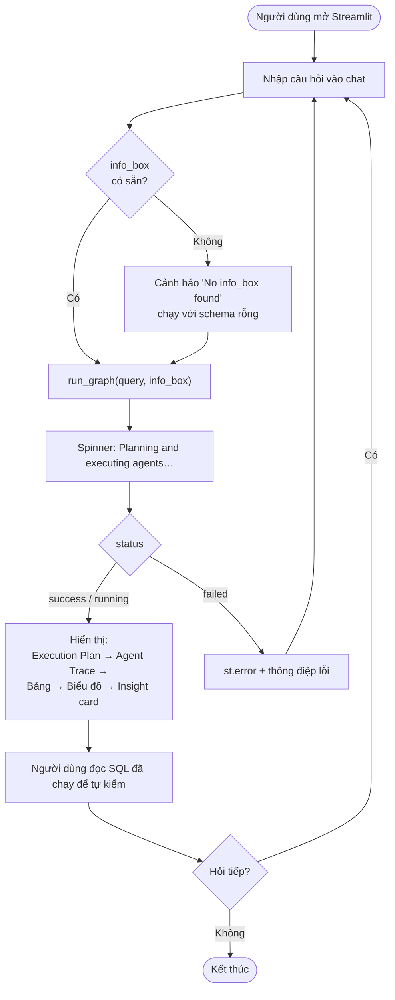
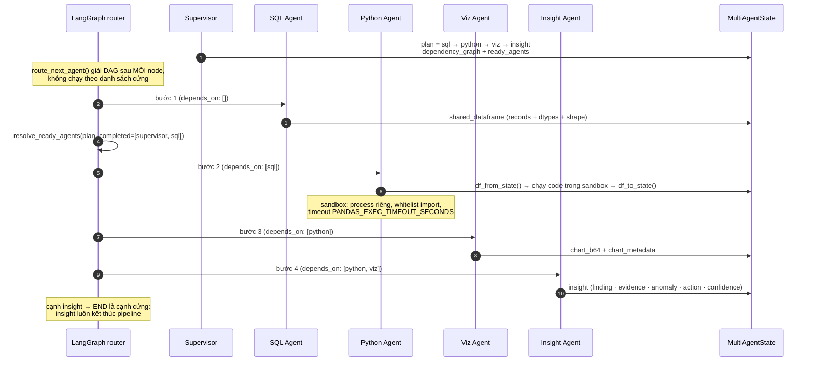
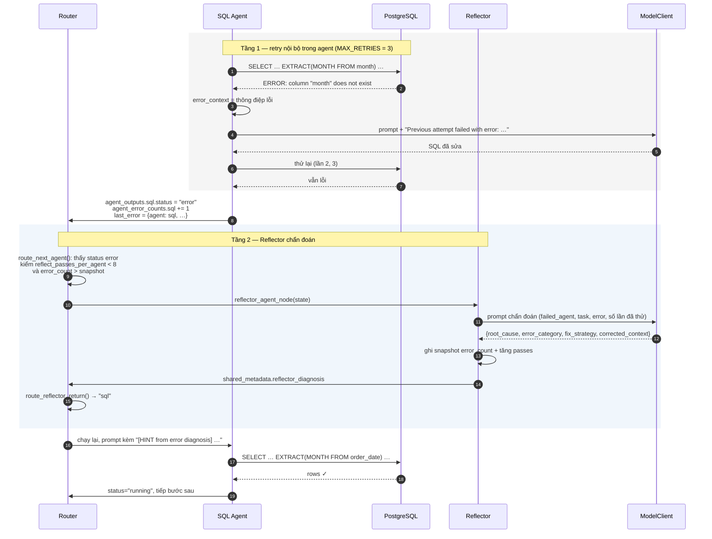
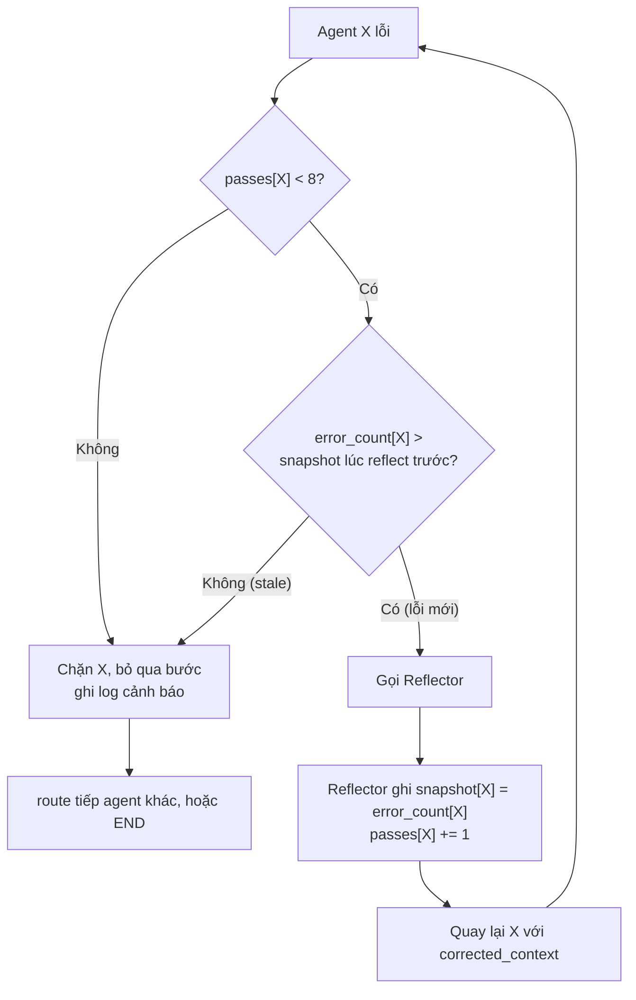
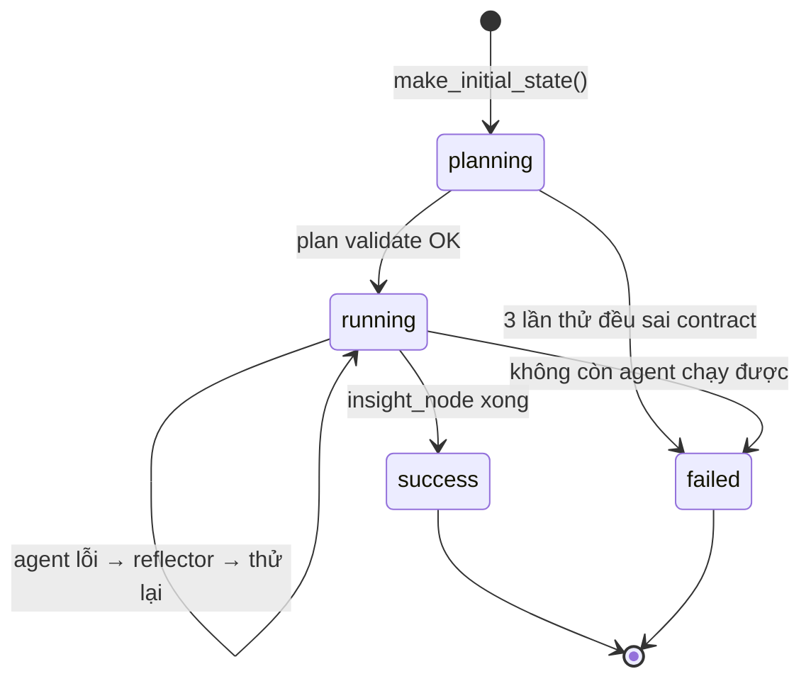
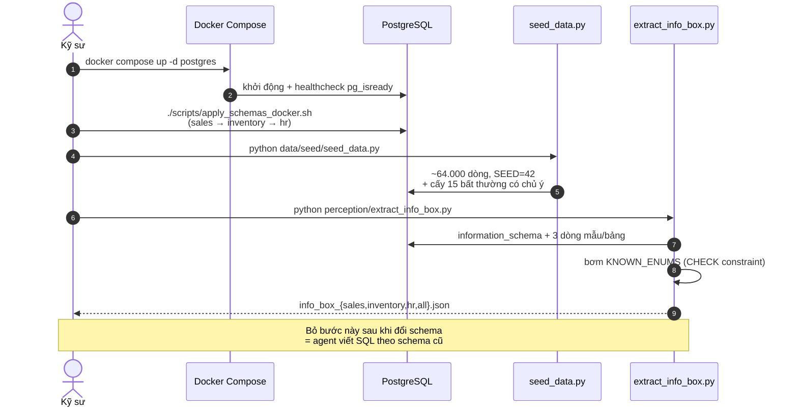

# User Flow & Sequence Diagrams — ADBA

> Ai gọi ai, theo thứ tự nào, và trạng thái đổi ra sao ở mỗi bước.

---

## 1. User flow tổng quát



Chi tiết đáng chú ý: **mỗi câu hỏi là một lần chạy graph độc lập**. `st.session_state.messages`
chỉ lưu lịch sử để hiển thị, không được nạp vào prompt. Hội thoại nhiều lượt có nhớ ngữ cảnh
nằm ở backlog B-03.

## 2. Truy vấn đơn giản — chỉ SQL + Insight

Ví dụ: *"Tổng doanh thu năm 2024 là bao nhiêu?"*

```mermaid
sequenceDiagram
    autonumber
    actor U as Người dùng
    participant UI as Streamlit (app.py)
    participant G as LangGraph
    participant SUP as Supervisor
    participant MC as ModelClient
    participant OL as Ollama
    participant SQLA as SQL Agent
    participant PG as PostgreSQL
    participant INS as Insight Agent

    U->>UI: "Tổng doanh thu năm 2024?"
    UI->>G: run_graph(query, info_box)
    G->>SUP: supervisor_node(state)
    SUP->>MC: invoke_json(prompt + info_box)
    MC->>OL: POST /api/chat (temp 0.1, 800 tokens)
    OL-->>MC: JSON plan (có thể bọc ```json)
    MC-->>SUP: dict đã bóc fence
    SUP->>SUP: ExecutionPlan.model_validate()<br/>kiểm 7 bất biến DAG
    SUP-->>G: state.execution_plan = [sql, insight]

    G->>G: route_next_agent() → "sql"
    G->>SQLA: sql_agent_node(state)
    SQLA->>MC: invoke(text_to_sql + info_box + task)
    MC->>OL: POST /api/chat (temp 0.0)
    OL-->>SQLA: "```sql SELECT SUM(amount)…```"
    SQLA->>SQLA: _extract_sql() bóc fence
    SQLA->>PG: SET LOCAL statement_timeout; SELECT …
    PG-->>SQLA: rows
    SQLA->>PG: EXPLAIN <sql>
    PG-->>SQLA: cost estimate
    SQLA-->>G: shared_dataframe + sql_result + trace

    G->>G: route_next_agent() → "insight"
    G->>INS: insight_agent_node(state)
    INS->>MC: invoke_json(insight prompt + stats)
    MC->>OL: POST /api/chat (temp 0.2)
    OL-->>INS: JSON insight
    INS->>INS: InsightOutput.model_validate()
    INS-->>G: state.insight, status="success"

    G-->>UI: MultiAgentState
    UI->>U: Plan · Trace · Bảng · Insight card
```

## 3. Truy vấn phức tạp — bốn agent, có phụ thuộc

Ví dụ: *"So sánh doanh thu theo vùng 2024 với 2023, vẽ biểu đồ và cho biết vùng nào bất thường"*



**Điểm dễ hiểu nhầm**: bộ định tuyến không "chạy tuần tự theo plan". Sau mỗi node nó giải lại
toàn bộ DAG (`resolve_ready_agents`) và tính tập agent *sẵn sàng*. Hiện tại nó nhận agent đầu tiên
trong tập đó, nhưng `state["ready_agents"]` và `shared_metadata["parallel_ready"]` đã phơi sẵn
toàn bộ tập để sau này dispatch song song mà không phải viết lại bộ định tuyến.

## 4. Vòng self-repair — SQL lỗi

Đây là luồng làm ADBA khác một wrapper text-to-SQL. Có **hai tầng sửa lỗi** lồng nhau.



### Cơ chế chống lặp vô hạn

Điều kiện gọi Reflector không chỉ là "agent lỗi" — nếu thế thì `sql ↔ reflector` sẽ quay mãi.



Hai bộ đếm nằm trong `shared_metadata`:

| Khoá | Ý nghĩa |
|---|---|
| `reflect_passes_per_agent` | Số lần Reflector đã chẩn đoán cho agent này — trần cứng `MAX_REFLECTOR_PASSES_PER_AGENT = 8` |
| `reflect_error_snapshot` | `error_count` tại lần chẩn đoán gần nhất — nếu không tăng thêm nghĩa là thử lại **không tạo ra lỗi mới**, tức là bế tắc |

Điều kiện thứ hai tinh tế hơn vẻ ngoài: nó phân biệt *"lỗi mới, đáng chẩn đoán lại"* với
*"vẫn kẹt ở chỗ cũ"*, thay vì chỉ đếm số lần.

## 5. Vòng đời state trong một lần chạy



| Trạng thái | Nghĩa | UI hiển thị |
|---|---|---|
| `planning` | Supervisor đang lập kế hoạch | Spinner |
| `running` | Đang thực thi các bước | Spinner |
| `success` | Insight đã sinh và validate xong | Đầy đủ các mục |
| `failed` | Không lập được plan, hoặc không còn agent nào chạy được | `st.error` + trace để chẩn đoán |

> **Khoảng trống đã biết**: chưa có trạng thái `partial` — truy vấn hết giờ giữa chừng hiện
> không có đường trả về kết quả trung gian. Node `finalize` của M3.2 sẽ bổ sung.

## 6. Luồng chuẩn bị dữ liệu (trước khi phục vụ)



---

<!-- AUTO:begin id=stamp -->

| Trường | Giá trị |
|---|---|
| Commit nguồn gần nhất | `05b24f0` — fix(sql): fail closed, statement_timeout 30s→10s, trần 50k dòng |
| Tác giả | Đặng Văn Vỹ |
| Ngày commit | 2026-09-01 |
| Số commit nguồn | 102 |
| Sinh bởi | `scripts/update_docs.py` (hook `post-commit`) |

<!-- AUTO:end id=stamp -->
