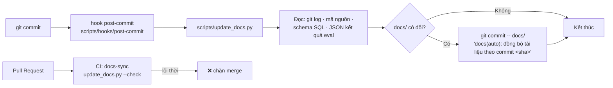

# Tài liệu tự cập nhật theo commit

> Cơ chế giữ cho `docs/` không lệch khỏi mã nguồn.

---

## 1. Vấn đề

Tài liệu chết vì cùng một lý do: có thứ đổi trong code mà không ai nhớ sửa tài liệu. Càng nhiều
số liệu chép tay (số dòng dữ liệu, tên biến môi trường, kết quả eval) thì càng nhanh sai — và một
tài liệu sai vài chỗ thì người đọc ngừng tin cả tài liệu.

Cách xử lý ở đây: **chia tài liệu làm hai loại nội dung.**

| Loại | Ví dụ | Ai viết |
|---|---|---|
| Lý lẽ, quyết định, đánh đổi | "Vì sao chọn LangGraph thay vì CrewAI" | Người — máy không suy ra được |
| Sự kiện rút được từ repo | Danh sách bảng, biến môi trường, số liệu eval, changelog | `scripts/update_docs.py` |

## 2. Cách hoạt động

### Khối AUTO

Nội dung loại hai nằm giữa một cặp marker HTML:

```markdown
## Chi tiết từng bảng

<!-- AUTO:begin id=db-tables -->

...script sinh vào đây, đừng sửa tay...

<!-- AUTO:end id=db-tables -->
```

Marker là comment HTML nên **không hiện khi render** Markdown. Mọi thứ ngoài cặp marker không
bao giờ bị script đụng tới.

### Dòng chảy



Hai lớp: hook chạy cục bộ cho tiện, CI chặn nếu ai đó chưa cài hook.

## 3. Cài đặt

Một lần cho mỗi bản clone:

```bash
bash scripts/install_docs_hooks.sh
```

Lệnh này đặt `git config core.hooksPath scripts/hooks` — hook nằm trong repo nên versioned và
dùng chung cho cả nhóm (`.git/hooks` không được commit).

Gỡ:

```bash
bash scripts/install_docs_hooks.sh --uninstall
```

## 4. Dùng bằng tay

```bash
python3 scripts/update_docs.py           # ghi lại các khối AUTO
python3 scripts/update_docs.py --check   # không ghi, exit 1 nếu lỗi thời (CI dùng cái này)
python3 scripts/update_docs.py --list    # liệt kê id khối và nơi xuất hiện
```

Script chỉ dùng thư viện chuẩn — chạy được trước khi cài `requirements.txt`.

## 5. Các khối có sẵn

| `id` | Nội dung sinh ra | Nguồn dữ liệu |
|---|---|---|
| `stamp` | Dấu vết commit nguồn gần nhất | `git log` |
| `changelog` | Lịch sử thay đổi nhóm theo phiên bản và loại commit | `git tag`, `git log` |
| `commit-history` | 15 commit gần nhất | `git log` |
| `repo-map` | Bản đồ thư mục: số file, số dòng, vai trò | `git ls-files` |
| `tech-stack` | Bảng phụ thuộc kèm vai trò và lý do chọn | `requirements.txt` + `STACK_RATIONALE` trong script |
| `env-vars` | Mọi biến môi trường được đọc trong code | `os.getenv(...)` + `env.example` |
| `db-tables` | Cột, kiểu, ràng buộc từng bảng | `data/schemas/schema_*.sql` |
| `db-erd` | Sơ đồ ERD Mermaid | Khoá ngoại trong DDL |
| `db-rowcounts` | Số dòng, số cột, FK, index từng bảng | `perception/info_box_all.json` |
| `anomalies` | Danh mục bất thường cấy vào dữ liệu seed | `ANOMALY_CATALOGUE` trong `seed_data.py` |
| `datasets` | Kích thước và phân bố skill các file JSONL | `data/*.jsonl` |
| `agents` | Node, prompt, retry, temperature, max tokens, timeout | `graph/agents/*.py` + `model/model_config.py` |
| `prompts` | Kích thước và placeholder từng prompt | `prompts/*.txt` |
| `state-fields` | Các trường của `MultiAgentState` | `graph/state.py` |
| `metrics` | Bảng so sánh baseline vs fine-tuned | `eval/baseline_results.json`, `training/finetuned_checkpoint50_results.json` |
| `tests` | Số test theo file | `tests/**/*.py` |

Một `id` dùng được ở nhiều file; script chỉ tính một lần rồi chèn vào mọi chỗ.

## 6. Thêm một khối mới

1. Viết hàm sinh trong `scripts/update_docs.py`, trả về chuỗi Markdown:

   ```python
   def gen_my_block() -> str:
       rows = [["a", "b"]]
       return table(["Cột 1", "Cột 2"], rows)
   ```

2. Đăng ký vào `GENERATORS`:

   ```python
   GENERATORS = {
       ...
       "my-block": gen_my_block,
   }
   ```

3. Đặt marker vào file `.md` cần hiển thị:

   ```markdown
   <!-- AUTO:begin id=my-block -->
   <!-- AUTO:end id=my-block -->
   ```

4. Chạy `python3 scripts/update_docs.py`.

Marker có `id` không có generator sẽ được **giữ nguyên** kèm cảnh báo ra stderr — an toàn khi
đổi tên hoặc đang làm dở.

## 7. Vì sao thiết kế như vậy

| Quyết định | Lý do |
|---|---|
| `post-commit` chứ không phải `pre-commit` | Changelog cần sha và thông điệp của chính commit đó — lúc `pre-commit` chúng chưa tồn tại |
| Commit phụ chứ không `--amend` | `--amend` trong hook hỏng khi rebase, cherry-pick, hoặc khi commit đã được push |
| Bỏ commit `docs(auto):` khỏi changelog và khỏi `stamp` | Nếu không, mỗi commit tài liệu lại làm tài liệu lỗi thời → hook tự kích hoạt lặp vô hạn |
| `stamp` không có thời gian thực (wall clock) | Nếu có, chạy lại script lúc nào cũng sinh diff → `--check` luôn đỏ và commit rác liên tục |
| `git commit -- docs/` chứ không `git add` rồi commit | Không kéo theo phần đang staged dở của người dùng vào commit tài liệu |
| CI chỉ `--check`, không tự commit ngược vào repo | Bot commit vào `main` dễ tạo vòng lặp CI và làm rối lịch sử |
| `repo-map` không đếm số dòng của `docs/` | Script ghi vào chính `docs/`, nên đếm dòng ở đó là tự tham chiếu: mỗi lần sinh lại đổi số → khối không bao giờ hội tụ |
| Đếm commit bằng log đã lọc, không dùng `git rev-list --count HEAD` | Con số đó tăng sau mỗi commit `docs(auto)`, làm khối `stamp` lỗi thời ngay khi hook vừa chạy xong |
| Lọc commit `docs(auto)` bằng `--extended-regexp` | Mặc định `git --grep` dùng regex **cơ bản**, ở đó `\(` là mở nhóm chứ không phải dấu ngoặc — bộ lọc sẽ im lặng không khớp gì cả |
| Marker trong code fence bị bỏ qua | Chính tài liệu này có ví dụ marker; nếu không bỏ qua thì script sẽ đổ nội dung thật vào ví dụ minh hoạ |
| Chỉ dùng thư viện chuẩn | Job CI không cần cài `requirements.txt` mới chạy được |

## 8. Xử lý sự cố

| Hiện tượng | Nguyên nhân thường gặp | Cách xử lý |
|---|---|---|
| Commit xong không thấy `docs(auto):` | Chưa cài hook | `bash scripts/install_docs_hooks.sh`; kiểm bằng `git config core.hooksPath` |
| CI báo tài liệu lỗi thời | Commit từ máy chưa cài hook | Chạy `python3 scripts/update_docs.py`, commit kết quả |
| Khối AUTO trống rỗng | Nguồn dữ liệu không tồn tại (ví dụ chưa chạy `extract_info_box.py`) | Script ghi thông điệp giải thích ngay trong khối |
| Hook không chạy khi rebase | Cố ý — hook tự thoát khi đang rebase/merge/cherry-pick | Chạy tay sau khi rebase xong |
| Sửa tay trong khối AUTO rồi mất | Đúng như thiết kế | Sửa hàm sinh trong `scripts/update_docs.py`, hoặc đưa nội dung ra ngoài cặp marker |
| Cần commit gấp, bỏ qua hook | — | `ADBA_DOCS_HOOK=1 git commit -m "..."` |

## 9. Giới hạn

- Script không kiểm tra **văn xuôi** có còn đúng không. Một quyết định kiến trúc bị đảo ngược
  trong code vẫn nằm nguyên trong tài liệu cho tới khi có người sửa. Đây là ranh giới cố ý:
  máy lo phần sự kiện, người lo phần lý lẽ.
- Sơ đồ Mermaid vẽ tay (trừ ERD) không tự cập nhật.
- Cross-reference giữa các file không được kiểm tra — link hỏng phải phát hiện bằng mắt hoặc
  bằng một link checker riêng.

---

<!-- AUTO:begin id=stamp -->

| Trường | Giá trị |
|---|---|
| Commit nguồn gần nhất | `eb65083` — feat(eval): dịch SQL vàng SQLite sang Postgres, mở BIRD cho tầng 2 |
| Tác giả | Đặng Văn Vỹ |
| Ngày commit | 2026-09-01 |
| Số commit nguồn | 100 |
| Sinh bởi | `scripts/update_docs.py` (hook `post-commit`) |

<!-- AUTO:end id=stamp -->
