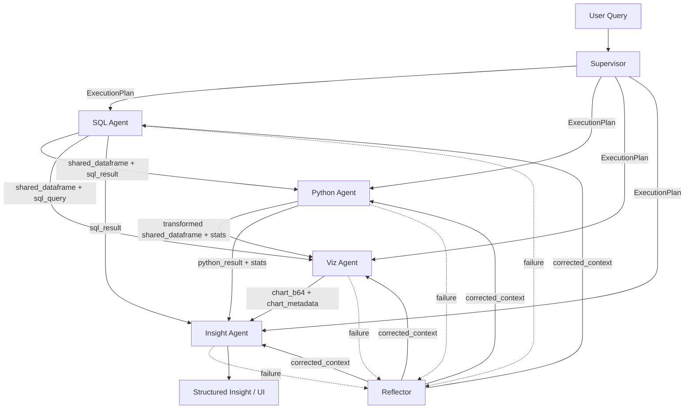

# Multi-Agent Interaction Analysis

- Project root: `/Users/dangvanvy/Documents/ADBA — Autonomous Data & Business Intelligence Agent`
- Graph module: `/Users/dangvanvy/Documents/ADBA — Autonomous Data & Business Intelligence Agent/graph/multi_agent.py`
- Entry point: `supervisor`

## State Contract

`query`, `info_box`, `execution_plan`, `current_agent`, `completed_agents`, `agent_outputs`, `shared_dataframe`, `shared_metadata`, `error_count`, `agent_error_counts`, `last_error`, `sql_result`, `python_result`, `chart_b64`, `chart_metadata`, `insight`, `action_trace`, `status`

## Normal Flow

- `supervisor -> sql -> insight`
- `supervisor -> sql -> python -> insight`
- `supervisor -> sql -> viz -> insight`
- `supervisor -> sql -> python -> viz -> insight`

## Recovery Flow

- specialist error -> supervisor.route_next_agent() -> reflector
- reflector -> failed specialist (sql/python/viz/insight)
- reflector hints are injected via shared_metadata.reflector_diagnosis.corrected_context
- stale or over-budget failures are skipped by the router

## Agent Roles

### `supervisor`
- Module: `/Users/dangvanvy/Documents/ADBA — Autonomous Data & Business Intelligence Agent/graph/agents/supervisor.py`
- Role: Plans the execution order and validates the ExecutionPlan schema.
- Reads state: `agent_error_counts`, `agent_outputs`, `completed_agents`, `error_count`, `execution_plan`, `info_box`, `last_error`, `query`, `shared_metadata`, `status`
- Writes state: `action_trace`, `agent_error_counts`, `agent_outputs`, `completed_agents`, `current_agent`, `error_count`, `execution_plan`, `last_error`, `status`
- Retry config: `MAX_REFLECTOR_PASSES_PER_AGENT=8`
- Consumes from: (none)
- Produces: execution_plan, agent_outputs.supervisor, status

### `sql`
- Module: `/Users/dangvanvy/Documents/ADBA — Autonomous Data & Business Intelligence Agent/graph/agents/sql_agent.py`
- Role: Generates SQL, executes it, and serializes the result into shared state.
- Reads state: `agent_error_counts`, `agent_outputs`, `completed_agents`, `error_count`, `execution_plan`, `info_box`, `shared_metadata`
- Writes state: `action_trace`, `agent_error_counts`, `agent_outputs`, `completed_agents`, `current_agent`, `error_count`, `last_error`, `shared_dataframe`, `shared_metadata`, `sql_result`, `status`
- Retry config: `MAX_RETRIES=3`
- Consumes from: supervisor
- Produces: shared_dataframe, sql_result, shared_metadata.sql_query

### `python`
- Module: `/Users/dangvanvy/Documents/ADBA — Autonomous Data & Business Intelligence Agent/graph/agents/python_agent.py`
- Role: Runs pandas transformations on the shared DataFrame.
- Reads state: `agent_error_counts`, `agent_outputs`, `completed_agents`, `error_count`, `execution_plan`, `shared_dataframe`, `shared_metadata`
- Writes state: `action_trace`, `agent_error_counts`, `agent_outputs`, `completed_agents`, `current_agent`, `error_count`, `last_error`, `python_result`, `shared_dataframe`, `shared_metadata`, `status`
- Retry config: `MAX_RETRIES=2`
- Consumes from: sql, reflector
- Produces: shared_dataframe, python_result, shared_metadata.python_stats

### `viz`
- Module: `/Users/dangvanvy/Documents/ADBA — Autonomous Data & Business Intelligence Agent/graph/agents/viz_agent.py`
- Role: Generates and executes chart code, returning base64 PNG metadata.
- Reads state: `agent_error_counts`, `agent_outputs`, `completed_agents`, `error_count`, `execution_plan`, `shared_dataframe`, `shared_metadata`
- Writes state: `action_trace`, `agent_error_counts`, `agent_outputs`, `chart_b64`, `chart_metadata`, `completed_agents`, `current_agent`, `error_count`, `last_error`, `shared_metadata`, `status`
- Retry config: `MAX_RETRIES=2`
- Consumes from: sql or python, reflector
- Produces: chart_b64, chart_metadata, shared_metadata.chart_type

### `insight`
- Module: `/Users/dangvanvy/Documents/ADBA — Autonomous Data & Business Intelligence Agent/graph/agents/insight_agent.py`
- Role: Builds the final structured business insight from prior outputs.
- Reads state: `agent_error_counts`, `agent_outputs`, `completed_agents`, `error_count`, `execution_plan`, `query`, `shared_dataframe`, `shared_metadata`
- Writes state: `action_trace`, `agent_error_counts`, `agent_outputs`, `completed_agents`, `current_agent`, `error_count`, `insight`, `last_error`, `status`
- Retry config: `(none)`
- Consumes from: sql, python, viz
- Produces: insight, status=success

### `reflector`
- Module: `/Users/dangvanvy/Documents/ADBA — Autonomous Data & Business Intelligence Agent/graph/agents/reflector_agent.py`
- Role: Diagnoses failed specialist steps and injects corrected retry context.
- Reads state: `agent_error_counts`, `agent_outputs`, `execution_plan`, `last_error`, `shared_metadata`
- Writes state: `action_trace`, `agent_outputs`, `current_agent`, `shared_metadata`, `status`
- Retry config: `(none)`
- Consumes from: sql/python/viz/insight failure
- Produces: shared_metadata.reflector_diagnosis, agent_outputs.reflector

## Handoffs

- `supervisor` -> `sql/python/viz/insight` via `execution_plan`: Dependency order is plan-driven, not hardcoded per query.
- `sql` -> `python/viz/insight` via `shared_dataframe + sql_result + shared_metadata.sql_query`: DataFrame is serialized through df_to_state().
- `python` -> `viz/insight` via `shared_dataframe + python_result + shared_metadata.python_stats`: Python can replace the shared DataFrame with transformed output.
- `viz` -> `insight/UI` via `chart_b64 + chart_metadata`: Visualization is optional and does not overwrite shared_dataframe.
- `reflector` -> `sql/python/viz/insight` via `shared_metadata.reflector_diagnosis`: Retry hint is appended to the next user prompt for the failed specialist.

## Mermaid

